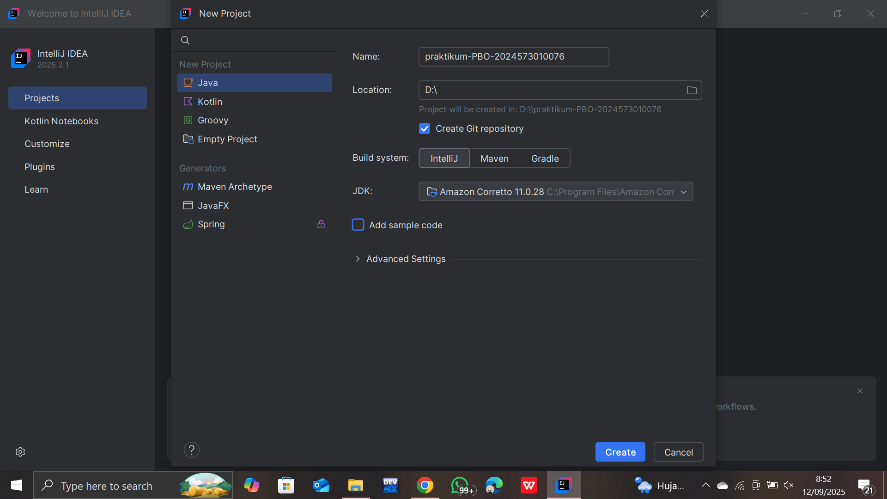
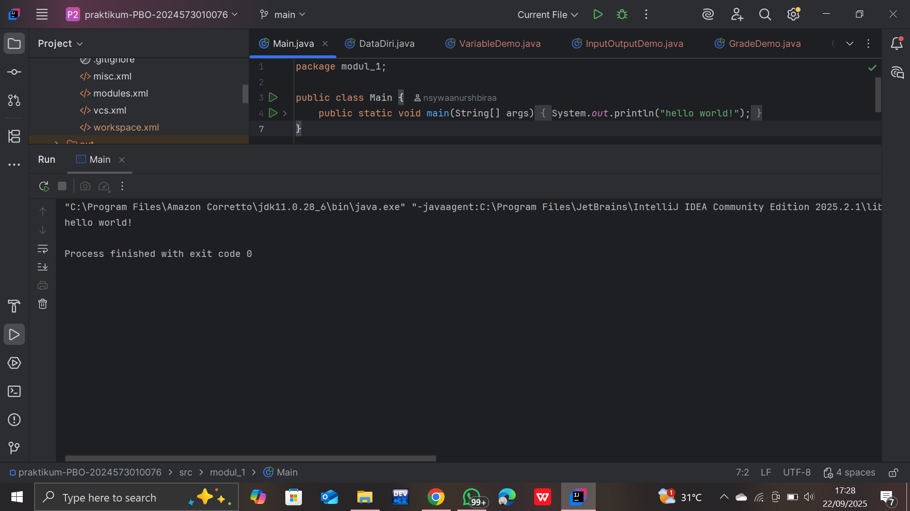
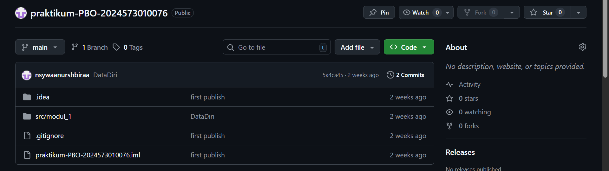

# Laporan Modul 1: Perkenalan Java dan Ekosistemnya
**Mata Kuliah:** Praktikum Pemrograman Berorientasi Objek   
**Nama:** Nasywa Nurshabira  
**NIM:** 2024573010076  
**Kelas:** TI 2A

---

## Abstrak
Pemrograman Berbasis Objek (OOP) adalah 
paradigma pemrograman yang mengorganisir 
kode dalam bentuk objek yang memiliki 
atribut (properties) sebagai karakteristik atau 
data yang dimiliki objek, serta method (behavior) 
sebagai tindakan atau fungsi yang dapat dilakukan objek.
Paradigma ini memberikan berbagai keuntungan signifikan
dalam pengembangan software modern. 
Modularitas merupakan keuntungan pertama dimana 
kode terorganisir dalam unit-unit terpisah 
sehingga memudahkan pengembang untuk fokus 
pada bagian tertentu tanpa mengganggu bagian lain. 
Reusability memungkinkan kode yang telah dibuat 
dapat digunakan kembali di berbagai bagian aplikasi 
atau bahkan di project yang berbeda, 
sehingga menghemat waktu dan effort pengembangan. 
Maintainability menjadikan kode mudah dipelihara dan 
dimodifikasi karena struktur yang jelas dan terorganisir 
memungkinkan developer untuk dengan cepat mengidentifikasi dan memperbaiki masalah. 
Terakhir, scalability memungkinkan aplikasi dapat dikembangkan untuk proyek besar dengan menambahkan fitur-fitur baru tanpa merusak struktur yang sudah ada.

---

## 1. Pendahuluan
- ### Teori Lengkap tentang Java

#### 1. Sejarah & Latar Belakang
- Java dikembangkan oleh **Sun Microsystems** dan diumumkan tahun **1995**.
- Penciptanya adalah *James Gosling* dkk.
- Tujuan utama: *Write Once, Run Anywhere (WORA)* melalui penggunaan **bytecode** dan **Java Virtual Machine (JVM)**.

---

#### 2. Filosofi Desain
Java didesain agar:
- **General-purpose**: bisa dipakai untuk desktop, web, enterprise, hingga mobile.
- **Concurrent**: mendukung multithreading.
- **Class-based, object-oriented**: berorientasi pada objek.
- **Strong, static typing**: tipe diperiksa saat kompilasi.
- **Memory safe**: garbage collection, array bounds checking, tanpa pointer eksplisit.
- **Sederhana** dibanding C++, tanpa multiple inheritance.

---

#### 3. Fitur Utama Java
| Fitur | Penjelasan |
|-------|------------|
| **Tipe primitif & referensi** | Primitif menyimpan nilai langsung; referensi menunjuk ke objek.|
| **Generics** | Parameterisasi tipe, diterapkan dengan *type erasure*. |
| **Inheritance tunggal & interface** | Hanya satu superclass, tapi banyak interface. |
| **Polimorfisme** | Overloading, overriding, subtyping. | 
| **Encapsulation** | Access modifier: `public`, `private`, `protected`. | 
| **Abstraction** | Abstract class dan interface. | 
| **Exception Handling** | `try`, `catch`, `finally`, `throws`. | 
| **Garbage Collection** | Manajemen memori otomatis. | 
| **Multithreading** | `Thread`, `synchronized`, concurrent libs. | 
| **JVM & Bytecode** | Platform independent execution. | 
| **Security** | Sandbox, type checking, no pointer arithmetic. | 

---

#### 4. Model Eksekusi
- Kode Java → **javac** → bytecode `.class`.
- Bytecode dijalankan oleh **JVM** dengan dukungan JIT compilation.
- JVM terdiri dari: Class Loader, Execution Engine, Garbage Collector.

---

#### 5. Sistem Tipe
- **Static typing**: tipe dicek saat kompilasi.
- **Strong typing**: konversi tipe harus eksplisit.
- **Subtyping nominal**: berdasarkan hierarki kelas/interface, bukan struktur.
- **Generics & wildcard**: `? extends T`, `? super T`.
- Implementasi generics di Java menggunakan **type erasure**.

---

#### 6. Kelebihan & Kekurangan
**Kelebihan:**
- Portabilitas tinggi (JVM).
- Aman, stabil, dan robust.
- Dukungan konkuren kuat.
- Ekosistem besar (library, framework).

**Kekurangan:**
- Performa lebih rendah dibanding bahasa native.
- Generics kompleks (karena type erasure).
- Memory overhead tinggi.
- Tidak ada multiple inheritance untuk kelas.

---

#### 7. Perkembangan Versi
- Penambahan fitur dari waktu ke waktu: **lambda**, **streams**, **modules**, **records**, **sealed classes**, dll.
- Fitur baru diuji sebagai *preview features*.


---

#### 8. Aspek Teoretis (Penelitian Akademik)
- *Subtyping in Java is a Fractal* — Moez A. AbdelGawad  
  - Struktur subtyping Java kompleks, menyerupai fraktal.
- *Java Generics: An Order-Theoretic Approach* — Moez A. AbdelGawad  
  - Pendekatan teori urutan untuk memahami generics.
- *Towards a Java Subtyping Operad* — Moez A. AbdelGawad  
  - Menggunakan teori kategori (operad) untuk subtyping.


---

#### 9. Kesimpulan
- Java adalah bahasa **OOP + generik** dengan sistem tipe statis yang kuat.
- JVM membuat Java portable dan aman.
- Sistem tipe Java kaya fitur, tetapi kompleks.
- Java terus berkembang dengan fitur modern.

---


## 2. Proses instalasi Java
- ### Praktikum 1: Instalasi JDK 21 (Amazon Corretto)

#### Pengantar
Amazon Corretto adalah distribusi **OpenJDK** yang gratis, multiplatform, dan production-ready yang dikembangkan oleh Amazon.  
Corretto menyediakan long-term support dan optimasi performa sehingga ideal untuk pembelajaran maupun development profesional.

---

#### Langkah 1: Akses Website Amazon Corretto
1. Buka browser (Chrome, Firefox, atau Edge).
2. Kunjungi [https://aws.amazon.com/corretto/](https://aws.amazon.com/corretto/)
3. Klik tombol **Download Amazon Corretto**.
4. Anda akan diarahkan ke halaman download yang menampilkan berbagai versi.

---

#### Langkah 2: Pilih Versi JDK yang Tepat
- Pilih **Amazon Corretto 17** atau **Amazon Corretto 21** (keduanya LTS).
- Untuk pemula, **Corretto 17** direkomendasikan karena stabil dan kompatibel.
- Pilih sesuai arsitektur sistem operasi:
    - **Windows x64** → Windows 64-bit (umum)
    - **Windows x86** → Windows 32-bit (jarang)
    - **macOS x64** → Mac Intel
    - **macOS aarch64** → Mac Apple Silicon (M1/M2)
    - **Linux x64** → Distribusi Linux 64-bit

---

#### Langkah 3: Download Installer
- Klik link download sesuai OS Anda.
- Format file:
    - **Windows**: `.msi`
    - **macOS**: `.pkg`
    - **Linux**: `.deb` (Ubuntu/Debian) atau `.rpm` (RedHat/CentOS)
- Ukuran file sekitar **200–300 MB**.
- Simpan di folder **Downloads** agar mudah diakses.

---

#### Langkah 4: Instalasi di Windows
1. Buka **File Explorer** → folder Downloads.
2. Double-click file installer (contoh: `amazon-corretto-21-x64-windows-jdk.msi`).
3. Klik **Yes** jika muncul dialog *User Account Control*.
4. Klik **Next** di welcome screen.
5. Centang **License Agreement**, lalu klik **Next**.
6. Biarkan pengaturan default, klik **Next**.
7. Catat installation path (default: `C:\Program Files\Amazon Corretto\jdk21.x.x_xx\`).
8. Klik **Install** → tunggu 2–5 menit.
9. Klik **Finish**.

---

#### Langkah 5: Instalasi di macOS
1. Buka **Finder** → folder Downloads.
2. Double-click file `.pkg` (contoh: `amazon-corretto-21-macos-x64.pkg`).
3. Klik **Continue** pada introduction screen.
4. Baca dan setujui **License Agreement**.
5. Pilih disk (default: Macintosh HD).
6. Klik **Install** → masukkan password admin.
7. Tunggu proses selesai, klik **Close**.
8. JDK terinstal di:  
   `/Library/Java/JavaVirtualMachines/amazon-corretto-21.jdk/`

---

#### Langkah 6: Instalasi di Linux (Ubuntu/Debian)
1. Buka Terminal (**Ctrl+Alt+T**).
2. Pindah ke folder Downloads:
   ```bash
   cd ~/Downloads
3. install deb:
    ```bash
   sudo dpkg -i amazon-corretto-21-x64-linux-jdk.deb
4. jika ada dependency issue:
    ```bash
   sudo apt-get install -f
5. verifikasi:
    ```bash
   dpkg -l | grep corretto

---
### Langkah 7: Verifikasi Instalasi
- **Windows**: Buka Command Prompt dengan menekan `Win+R`, ketik `cmd`, lalu tekan Enter
- **macOS**: Buka Terminal dari *Applications > Utilities > Terminal*
- **Linux**: Buka Terminal dengan `Ctrl+Alt+T`

Jalankan perintah berikut:
```bash
java -version
```

---
### Langkah 8: Setup Environment Variables (Khusus Windows)

1. Klik kanan pada **This PC** di desktop atau File Explorer, pilih **Properties**  
2. Klik **Advanced system settings** di panel kiri  
3. Pada dialog *System Properties*, klik **Environment Variables…**  
4. Di bagian *System variables*, klik **New…**  
   - **Variable name**: `JAVA_HOME`  
   - **Variable value**: `C:\Program Files\Amazon Corretto\jdk17.0.x_xx` *(sesuaikan dengan versi yang terinstall)*  
5. Klik **OK**  
6. Cari variable **Path** di *System variables*, klik **Edit…**  
7. Klik **New** dan tambahkan:  
   ```bash
   %JAVA_HOME%\bin
---
### Praktikum 2: Instalasi IntelliJ IDEA CE

#### Pengantar
IntelliJ IDEA Community Edition adalah IDE gratis dan powerful yang dikembangkan oleh JetBrains, sangat ideal untuk pembelajaran Java dan development profesional.

---

#### Langkah 1: Mengakses Website JetBrains
1. Buka browser web dan navigasikan ke: [https://www.jetbrains.com/idea/](https://www.jetbrains.com/idea/)
2. Pada halaman utama, Anda akan melihat dua pilihan: **Ultimate (berbayar)** dan **Community (gratis)**
3. Klik tombol **Download** di bawah "Community Edition"
4. Anda akan diarahkan ke halaman download yang otomatis mendeteksi sistem operasi Anda

---

#### Langkah 2: Download IntelliJ IDEA
- Pastikan tab **Community** dipilih (bukan Ultimate)
- Sistem akan otomatis mendeteksi OS Anda dan menampilkan tombol download yang sesuai
- Klik **Download** untuk memulai proses download
- Ukuran file sekitar **700MB – 1GB**, pastikan koneksi internet stabil
- File installer akan tersimpan di folder **Downloads** dengan nama seperti:
    - **Windows**: `ideaIC-2023.x.x.exe`
    - **macOS**: `ideaIC-2023.x.x.dmg`
    - **Linux**: `ideaIC-2023.x.x.tar.gz`

---

#### Langkah 3: Instalasi di Windows
1. Navigasikan ke folder **Downloads** dan double-click file `ideaIC-2023.x.x.exe`
2. Jika Windows menampilkan security warning, klik **Yes** atau **Run anyway**
3. Pada welcome screen, klik **Next**
4. Pilih installation directory (default: `C:\Program Files\JetBrains\IntelliJ IDEA Community Edition 2023.x.x`)
5. Klik **Next** untuk melanjutkan
6. Pada **Installation Options**, centang opsi berikut:
    - ✅ "64-bit launcher" (untuk sistem 64-bit)
    - ✅ "Add launchers dir to the PATH"
    - ✅ "Add 'Open Folder as Project'"
    - ✅ ".java" - Associate .java files
    - ✅ "Download and install JetBrains Runtime"
7. Klik **Next**
8. Pada Start Menu Folder, biarkan default lalu klik **Install**
9. Tunggu proses instalasi selesai (**5-10 menit**)
10. Centang **Run IntelliJ IDEA Community Edition** lalu klik **Finish**

---

#### Langkah 4: Instalasi di macOS
1. Buka file `ideaIC-2023.x.x.dmg` yang telah didownload
2. Drag icon **IntelliJ IDEA CE** ke folder **Applications**
3. Tunggu proses copy selesai
4. Buka **Applications** folder lalu double-click **IntelliJ IDEA CE**
5. Jika muncul security warning, klik **Open**
6. Jika diminta, masukkan **password administrator**

---

#### Langkah 5: Instalasi di Linux
1. Buka Terminal dan navigasikan ke folder **Downloads**:
   ```bash
   cd ~/Downloads
2. Extract file tar.gz:
    ```bash
   tar -xzf ideaIC-2023.x.x.tar.gz
3. Pindahkan ke direktori opt:

sudo mv idea-IC-* /opt/idea-ic
4. Buat symbolic link:
    ```bash
    sudo ln -s /opt/idea-ic/bin/idea.sh /usr/local/bin/idea
5. Jalankan IntelliJ IDEA:
    ```bash
    idea

---

#### Langkah 6: First Time Setup IntelliJ IDEA

1. Saat pertama kali membuka IntelliJ IDEA, akan muncul Welcome to IntelliJ IDEA
2. Pada dialog Import IntelliJ IDEA Settings, pilih Do not import settings → klik OK
3. Pilih UI Theme:
     - "Light" → tema terang
     - "Darcula" → tema gelap
4. Klik Next
5. Pada Default plugins, biarkan semua plugin default tercentang → klik Next
6. Pada Featured plugins, bisa skip dulu dengan klik Start using IntelliJ IDEA

---

#### Langkah 7: Verifikasi Konfigurasi JDK di IntelliJ IDEA

1. Pada Welcome screen, klik New Project
2. Di panel kiri, pilih Java
3. Pastikan Project SDK menampilkan Amazon Corretto yang sudah diinstall
4. Jika belum muncul, klik Add SDK → JDK
5. Arahkan ke folder instalasi Amazon Corretto:
    - **Windows**: `C:\Program Files\Amazon Corretto\jdk17.0.x_xx`
    - **macOS**: `/Library/Java/JavaVirtualMachines/amazon-corretto-17.jdk/Contents/Home`
    - **Linux**: `/usr/lib/jvm/java-17-amazon-corretto`
6. Klik OK untuk menambahkan JDK
7. Klik Cancel untuk keluar dari dialog New Project

---

#### Langkah 8: Konfigurasi Tambahan (Opsional namun Disarankan)

1. Pada Welcome screen, klik ⚙️ (gear icon) → Settings
2. Navigasikan ke: Editor → General → Auto Import
3. Centang Add unambiguous imports on the fly
4. Centang Optimize imports on the fly
5. Navigasikan ke: Editor → Code Style → Java
6. Atur Tab size dan Indent ke 4
7. Klik Apply dan OK

---
## 3. Laporan proses pembuatan program hello world dengan java

1. buat sebuah project baru di intellj dengan memilih `file -> new -> project`
2. pastikan lokasi penyimpanan sesuai:

3. Hilangkan checklist pada tulisan Create Git repository
4. Buat sebuah java class baru dan beri nama `Main` dengan klik kanan pada `folder src` pilih `new -> Java Class`
5. Tuliskan kode berikut:
   ```java
    public class Main {
        public static void main(String[] args) {
            System.out.println("Hello World");
        }
    } 
   ```
5. Jalankan programnya dan cek hasil nya.

---
### Cara Push Project ke GitHub

#### langkah 1: Buat Repository di GitHub
1. Login ke [GitHub](https://github.com)
2. Klik tombol **+** → pilih **New repository**
3. Isi **Repository name** → klik **Create repository**

---

#### langkah 2: Inisialisasi Git di Project Lokal
```bash
git init
```

---

#### langkah 3: tambahkan file dan commit
```
git add .
git commit -m "first publish"
```

---
#### langkah 4: hubungkan ke repository github
```
git remote add origin https://github.com/nsywaanurshbiraa/praktikum-PBO-2024573010076.git
```

---

#### langkah 5: push project ke github
```
git branch -M main
git push -u origin main
```

---

#### langkah 6: verifikasi
- buka repository di github
- refresh halaman
- pastikan semua file project sudah muncul


---

## 4. Referensi
1. Gosling, J., Joy, B., Steele, G., Bracha, G., Buckley, A. **Java Language Specification**. Oracle.  
   [Link](https://docs.oracle.com/javase/specs/jls/se13/html/jls-1.html)
2. Lindholm, T., Yellin, F., Bracha, G., Buckley, A. **Java Virtual Machine Specification**. Oracle.  
   [Link](https://docs.oracle.com/javase/specs/jls/se13/html/jls-1.html)
3. Herbert Schildt. *Java: The Complete Reference*. McGraw-Hill.
4. Joshua Bloch. *Effective Java*. Addison-Wesley.
5. Bruce Eckel. *Thinking in Java*. Prentice Hall.
6. Moez A. AbdelGawad. *Subtyping in Java is a Fractal*. arXiv:1411.5166.
7. GeeksforGeeks. *Introduction to Java*.  
   [Link](https://www.geeksforgeeks.org/java/introduction-to-java/)

---
