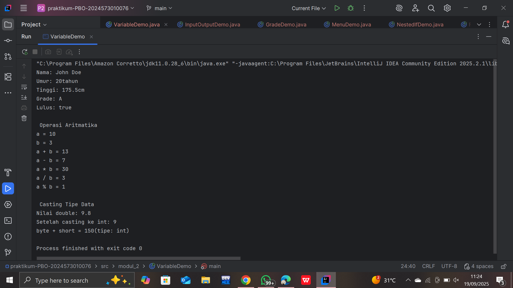
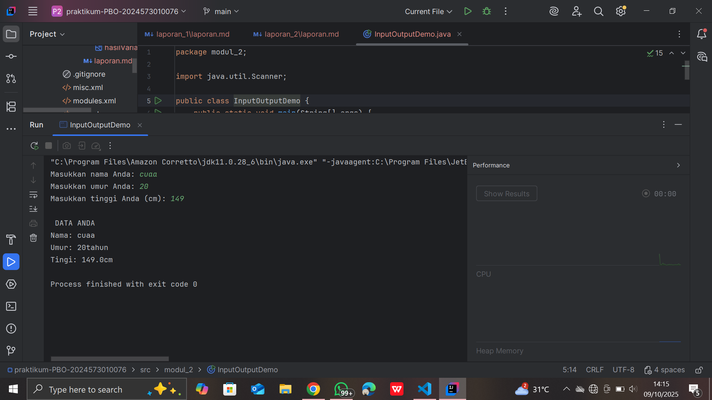
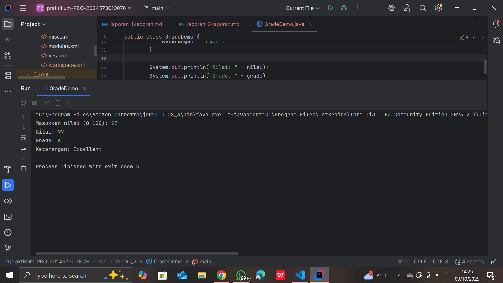
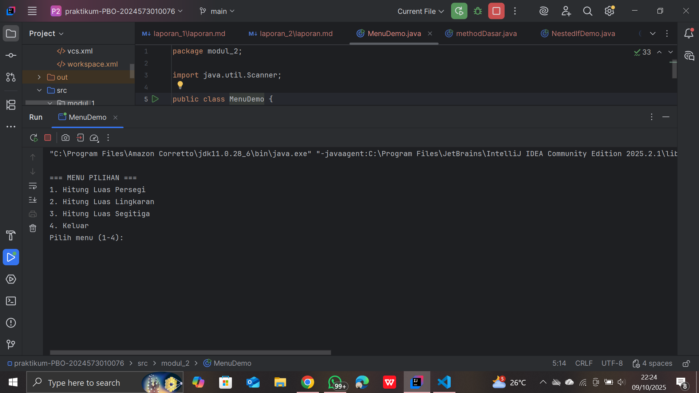
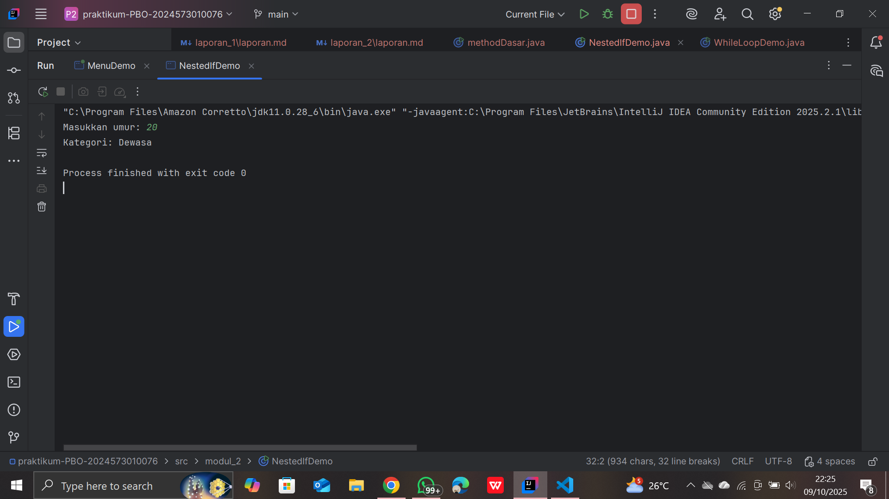
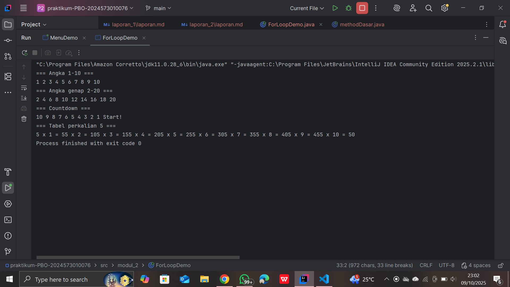
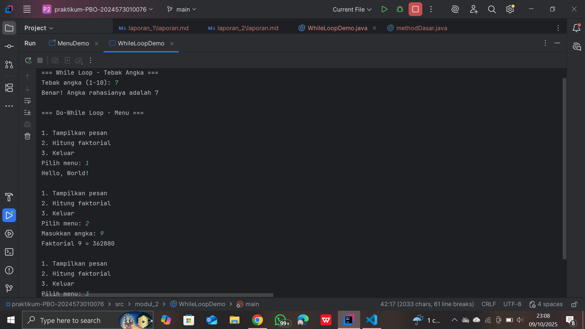
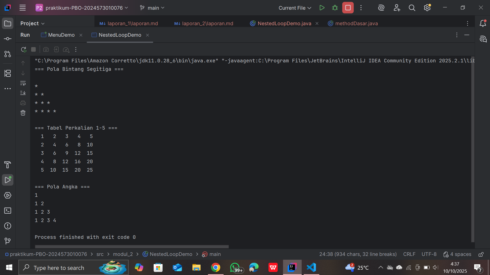

# Laporan Modul 2: Dasar Pemrograman Java
**Mata Kuliah:** Praktikum Pemrograman Berorientasi Objek   
**Nama:** Nasywa Nurshabira     
**NIM:** 2024573010076  
**Kelas:** TI 2A
---

## 1. Abstrak

Laporan praktikum ini membahas penerapan konsep dasar dalam pemrograman Java, meliputi penggunaan variabel, tipe data, operator, serta struktur kontrol seperti percabangan dan perulangan. Tujuan dari praktikum ini adalah untuk memahami cara kerja logika program serta bagaimana alur eksekusi dijalankan berdasarkan kondisi tertentu dan pengulangan proses. Melalui serangkaian percobaan, mahasiswa dapat mempraktikkan penerapan *for loop*, *while loop*, *do-while loop*, dan *nested loop* untuk menyelesaikan berbagai permasalahan logika secara efisien. Hasil dari praktikum menunjukkan bahwa penguasaan struktur kontrol sangat penting dalam pengembangan aplikasi berbasis Java karena menentukan efisiensi dan kejelasan kode program.

**Kata kunci:** Java, struktur kontrol, perulangan, percabangan, pemrograman dasar.

---
## 2. Praktikum
### Praktikum 1 - Variabel dan Tipe data
#### Dasar Teori
###### Java memiliki dua kategori tipe data:

***Tipe Data Primitif***

byte: bilangan bulat bertanda 8-bit (-128 hingga 127)   
short: bilangan bulat bertanda 16-bit (-32.768 hingga 32.767)  
int: bilangan bulat bertanda 32-bit (-2.147.483.648 hingga 2.147.483.647)   
Long: bilangan bulat bertanda 64-bit 
Float: 32-bit IEEE 754 floating point  
Double: 64-bit IEEE 754 floating point   
boolean: true atau false    
char: karakter Unicode 16-bit

***Tipe Data Reference***   
String, Array, Object, dll.

***Aturan Penamaan Variabel***  
Dimulai dengan huruf, underscore (_), atau dollar sign ($)
Tidak boleh dimulai dengan angka
Peka huruf besar/kecil
Tidak boleh menggunakan keyword Java

#### Langkah Praktikum
1. Buat file baru dengan nama VariabelDemo.java
2. ketik kode berikut
    
package modul_2;

public class VariableDemo {     
public static void main(String[] args) {    
// Deklarasi dan inisialisasi variabel  
int umur = 20;  
double tinggi = 175.5;  
char grade ='A';    
boolean lulus = true;   
String nama = "John Doe";

        //menampilkan nilai variabel
        System.out.println("Nama: " + nama);
        System.out.println("Umur: " + umur + "tahun");
        System.out.println("Tinggi: " + tinggi + "cm");
        System.out.println("Grade: " + grade);
        System.out.println("Lulus: " + lulus);

        int a = 10;
        int b = 3;

        System.out.println("\n Operasi Aritmatika ");
        System.out.println("a = " + a);
        System.out.println("b = " + b);
        System.out.println("a + b = " + (a + b));
        System.out.println("a - b = " + (a - b));
        System.out.println("a * b = " + (a * b));
        System.out.println("a / b = " + (a / b));
        System.out.println("a % b = " + (a % b));

        System.out.println("\n Casting Tipe Data");
        double nilaiDouble = 9.8;
        int nilaiInt = (int) nilaiDouble;

        System.out.println("Nilai double: " + nilaiDouble);
        System.out.println("Setelah casting ke int: " + nilaiInt);

        //Automatic promotion
        byte byteVar = 50;
        short shortVar = 100;
        int hasil = byteVar + shortVar;
        System.out.println("byte + short = " + hasil + "(tipe: int)");

    }
}
#### Screenshoot Hasil

#### Analisa dan Pembahasan
Analisa     
Program `VariableDemo` berfungsi untuk memperlihatkan bagaimana **variabel dan tipe data** digunakan dalam Java, serta bagaimana **operasi aritmatika dan konversi tipe data** dilakukan.  
Beberapa variabel dideklarasikan dengan tipe data berbeda seperti `int`, `double`, `char`, `boolean`, dan `String`.  
Bagian berikutnya menunjukkan operasi aritmatika dasar antara dua variabel (`a` dan `b`), lalu hasilnya ditampilkan di layar.  
Program juga menampilkan proses **type casting** dari `double` ke `int` yang menyebabkan nilai desimal dihilangkan, dan contoh **automatic type promotion** di mana hasil penjumlahan `byte` dan `short` secara otomatis dikonversi menjadi `int`.

Pembahasan  
Secara keseluruhan, program ini menggambarkan dasar pengelolaan data di Java.  
Melalui contoh yang sederhana, kita bisa melihat:
- Cara mendeklarasikan dan menginisialisasi variabel.
- Penggunaan operasi aritmatika untuk perhitungan sederhana.
- Proses konversi tipe data, baik manual (casting) maupun otomatis (promotion).

---

### Praktikum 2 - Input, Output, dan Scanner
#### Dasar Teori
Pada bahasa pemrograman **Java**, proses **input dan output** digunakan untuk berinteraksi dengan pengguna.  
**Input** berarti menerima data dari pengguna, sedangkan **output** berarti menampilkan informasi ke layar.

Untuk menerima input dari pengguna, Java menyediakan **kelas `Scanner`** yang berada dalam paket `java.util`.  
Kelas ini memungkinkan program membaca berbagai jenis data seperti **string, integer, double, dan boolean** langsung dari keyboard.

Agar dapat menggunakan `Scanner`, programmer harus menuliskan perintah:
> import java.util.Scanner;

Kemudian dibuat objek:
> Scanner input = new Scanner(System.in);

Beberapa metode umum yang digunakan:
- `nextLine()` → membaca teks (String)
- `nextInt()` → membaca bilangan bulat
- `nextDouble()` → membaca bilangan desimal
- `nextBoolean()` → membaca nilai true/false

Setelah selesai digunakan, objek `Scanner` sebaiknya ditutup dengan:
> input.close();

Dengan menggunakan **Scanner**, programmer dapat membuat program yang **interaktif dan dinamis**, karena pengguna bisa memberikan masukan langsung melalui terminal.

#### Langkah Praktikum
1. Buat file baru dengan nama InputOutputDemo.java
2. Ketik kode berikut:
```
package modul_2;

import java.util.Scanner;

public class InputOutputDemo {
    public static void main(String[] args) {
        // Membuat objek Sacnner
        Scanner input = new Scanner(System.in);
        // Membaca input string
        System.out.print("Masukkan nama Anda: ");
        String nama = input.nextLine();

        // Membaca input integer
        System.out.print("Masukkan umur Anda: ");
        int umur = input.nextInt();

        // Membaca iput double
        System.out.print("Masukkan tinggi Anda (cm): ");
        double tinggi = input.nextDouble();

        // Menampilkan output
        System.out.println("\n DATA ANDA");
        System.out.println("Nama: " + nama);
        System.out.println("Umur: " + umur + "tahun");
        System.out.println("Tingi: " + tinggi + "cm");

        // Menutup Scanner
        input.close();
    }
}
```
#### Screenshoot Hasil

#### Analisa dan Pembahasan

---

### Praktikum 3 - struktur control : percabangan
#### Dasar Teori
Struktur kontrol **percabangan (branching)** dalam bahasa pemrograman **Java** digunakan untuk mengatur alur eksekusi program berdasarkan kondisi tertentu.  
Percabangan memungkinkan program untuk **mengambil keputusan** — apakah suatu blok kode dijalankan atau dilewati, tergantung pada hasil evaluasi kondisi logika.

Terdapat beberapa bentuk percabangan di Java:

#### 1. **Percabangan `if`**
Digunakan untuk menjalankan perintah jika kondisi bernilai **true**.  
Jika kondisi **false**, maka blok kode tidak dijalankan.

#### 2. **Percabangan `if-else`**
Menjalankan satu blok kode jika kondisi **true**, dan blok kode lain jika kondisi **false**.

#### 3. **Percabangan `if-else if-else`**
Digunakan untuk memeriksa beberapa kondisi secara berurutan.  
Kondisi akan diperiksa dari atas ke bawah, dan hanya satu blok yang dijalankan sesuai kondisi yang pertama kali bernilai **true**.

#### 4. **Percabangan `switch-case`**
Digunakan ketika ada banyak pilihan berdasarkan nilai variabel tertentu.  
Struktur `switch` lebih efisien dan mudah dibaca dibandingkan banyak `if-else` berurutan.  
Setiap `case` merepresentasikan satu kemungkinan nilai, dan kata kunci `break` digunakan untuk menghentikan eksekusi agar tidak terus berlanjut ke case berikutnya.

#### 5. **Nested If (If Bersarang)**
Merupakan `if` yang berada di dalam `if` lain, digunakan saat diperlukan pemeriksaan kondisi tambahan di dalam suatu kondisi utama.

Struktur kontrol percabangan sangat penting karena memungkinkan program bersifat **dinamis dan adaptif** terhadap input atau keadaan tertentu.

#### Langkah Praktikum
langkah 1: Program penentu grade
1. Buat file baru dengan nama GradeDemo.java
2. isi dengan kode berikut:
```
package modul_2;

import java.util.Scanner;

public class GradeDemo {
    public static void main(String[] args) {
        Scanner input = new Scanner(System.in);

        System.out.print("Masukkan nilai (0-100): ");
        int nilai = input.nextInt();

        char grade;
        String keterangan;

        // Menggunakan if-else if-else
        if (nilai > 85) {
            grade = 'A';
            keterangan = "Excellent";
        } else if (nilai > 75) {
            grade = 'B';
            keterangan = "Good";
        } else if (nilai > 65) {
            grade = 'C';
            keterangan = "Fair";
        } else if (nilai > 55) {
            grade = 'D';
            keterangan = "Poor";
        } else {
            grade = 'E';
            keterangan = "Fail";
        }

        System.out.println("Nilai: " + nilai);
        System.out.println("Grade: " + grade);
        System.out.println("Keterangan: " + keterangan);

        input.close();
    }
}
```
#### Screenshoot Hasil


langkah 2: Program menu dengan switch
1. Buat file baru dengan nama MenuDemo.java
2. Implementasikan kode berikut:
```java
package modul_2;

import java.util.Scanner;

public class MenuDemo {
    public static void main(String[] args) {
        Scanner input = new Scanner(System.in);

        System.out.println("\n=== MENU PILIHAN ===");
        System.out.println("1. Hitung Luas Persegi");
        System.out.println("2. Hitung Luas Lingkaran");
        System.out.println("3. Hitung Luas Segitiga");
        System.out.println("4. Keluar");

        System.out.print("Pilih menu (1-4): ");
        int pilihan = input.nextInt();

        switch(pilihan) {
            case 1:
                System.out.print("Masukkan sisi persegi: ");
                double sisi = input.nextDouble();
                double LuasPersegi = sisi * sisi;
                System.out.println("Luas persegi: " + LuasPersegi);
                break;

            case 2:
                System.out.print("Masukkan jari-jari lingkaran: ");
                double jarijari = input.nextDouble();
                double luasLingkaran = Math.PI * jarijari * jarijari;
                System.out.println("Luas lingkaran: " + luasLingkaran);
                break;

            case 3:
                System.out.print("Masukkan alas segitiga: ");
                double alas = input.nextDouble();
                System.out.print("Masukkan tinggi segitiga: ");
                double tinggi = input.nextDouble();
                double LuasSegitiga = 0.5 * alas * tinggi;
                System.out.println("Luas segitiga: " + LuasSegitiga);
                break;

            case 4:
                System.out.println("Terima kasih!");
                break;

            default:
                System.out.println("Pilihan tidak valid");
        }

        input.close();
    }
}
```
#### Screenshot hasil

Langkah 3: Program Nested If
1. Buat file baru dengan nama NestedIfDemo.java
2. Implementasikan program untuk menentukan kategori usia:
```java
package modul_2;

import java.util.Scanner;

public class NestedIfDemo {
    public static void main(String[] args) {
        Scanner input = new Scanner(System.in);

        System.out.print("Masukkan umur: ");
        int umur = input.nextInt();

        if (umur >= 0) {
            if (umur <= 2) {
                System.out.println("Kategori: Bayi");
            } else if (umur <= 5) {
                System.out.println("Kategori: Balita");
            } else if (umur <= 12) {
                System.out.println("Kategori: Anak-anak");
            } else if (umur <= 19) {
                System.out.println("Kategori: Remaja");
            } else if (umur <= 59) {
                System.out.println("Kategori: Dewasa");
            } else {
                System.out.println("Kategori: Lansia");
            }
        } else {
            System.out.println("Umur tidak valid!");
        }

        input.close();
    }
}
```
#### Screenshot hasil

#### Analisa dan Pembahasan
#### Program 1: GradeDemo.java

#### Analisa
Program `GradeDemo` digunakan untuk menentukan **grade** berdasarkan nilai yang dimasukkan oleh pengguna.  
Program menggunakan **struktur kontrol if-else if-else** untuk mengevaluasi kondisi nilai dan menetapkan huruf grade (`A`–`E`) beserta keterangan yang sesuai.  
Nilai lebih dari 85 mendapat `A`, sedangkan nilai di bawah 55 mendapat `E`. Program ini juga memanfaatkan kelas `Scanner` untuk membaca input dari pengguna.

#### Pembahasan
Konsep utama dari program ini adalah **percabangan bersyarat**.  
Java akan mengevaluasi kondisi dari atas ke bawah hingga menemukan kondisi yang benar, lalu menjalankan blok kode yang sesuai.  
Dengan logika if-else yang tersusun rapi, program mampu menentukan hasil akhir dengan efisien.  
Penggunaan `Scanner` menambah interaktivitas karena pengguna dapat memasukkan nilai secara langsung.

---

#### Program 2: MenuDemo.java

#### Analisa
Program `MenuDemo` menampilkan **menu pilihan** yang terdiri dari beberapa opsi untuk menghitung luas bangun datar (persegi, lingkaran, dan segitiga).  
Program memanfaatkan **struktur kontrol switch-case** untuk mengeksekusi perintah berdasarkan angka menu yang dimasukkan pengguna.  
Setiap case berisi rumus perhitungan berbeda, dan `default` digunakan untuk menangani input yang tidak valid.

#### Pembahasan
Struktur **switch-case** digunakan agar program lebih terstruktur dan mudah dibaca dibandingkan menggunakan if-else berulang.  
Setiap pilihan dihubungkan langsung dengan proses perhitungan yang relevan:
- Persegi → sisi × sisi
- Lingkaran → π × r²
- Segitiga → ½ × alas × tinggi

Program ini menunjukkan penerapan percabangan multi-cabang dengan efisien, serta menampilkan hasil perhitungan yang interaktif sesuai pilihan pengguna.

---

#### Program 3: NestedIfDemo.java

#### Analisa
Program `NestedIfDemo` digunakan untuk menentukan **kategori usia** berdasarkan input umur dari pengguna.  
Struktur yang digunakan adalah **nested if** (percabangan bersarang), di mana satu kondisi `if` berada di dalam kondisi `if` lainnya.  
Jika umur valid (lebih dari atau sama dengan 0), maka akan diperiksa rentang umur dan dikategorikan menjadi “Bayi”, “Balita”, “Anak-anak”, “Remaja”, “Dewasa”, atau “Lansia”.

#### Pembahasan
Penggunaan **nested if** memungkinkan program melakukan pengecekan berlapis.  
Langkah pertama adalah memastikan umur valid, lalu barulah dilakukan pengecekan kategori umur berdasarkan rentang nilai.  
Struktur ini cocok digunakan untuk kasus yang membutuhkan logika bertingkat dan saling bergantung antar kondisi.  
Hasil akhirnya adalah kategori usia yang tampil sesuai umur yang diinput oleh pengguna.

---

### Praktikum 4: Struktur kontrol: perulangan
#### Dasar Teori
Struktur kontrol **perulangan (looping)** dalam bahasa pemrograman **Java** digunakan untuk mengeksekusi satu blok kode secara berulang selama kondisi tertentu terpenuhi.  
Dengan perulangan, programmer dapat menghindari penulisan kode yang sama berkali-kali, sehingga program menjadi lebih efisien dan mudah dikelola.

Terdapat beberapa jenis perulangan dalam Java:

#### 1. **Perulangan `for`**
Digunakan ketika jumlah perulangan sudah diketahui sebelumnya.  
Struktur dasarnya terdiri dari tiga bagian: inisialisasi, kondisi, dan iterasi (increment/decrement).  
Perulangan akan terus berjalan selama kondisi bernilai **true**.

#### 2. **Perulangan `while`**
Digunakan ketika jumlah perulangan **belum diketahui pasti** dan bergantung pada kondisi logika.  
Selama kondisi bernilai **true**, blok kode di dalam `while` akan terus dijalankan.

#### 3. **Perulangan `do-while`**
Mirip dengan `while`, namun perbedaannya adalah blok kode dijalankan **setidaknya satu kali**, karena pengecekan kondisi dilakukan **setelah** eksekusi pertama.

#### 4. **Nested Loop (Perulangan Bersarang)**
Adalah perulangan yang berada di dalam perulangan lain.  
Biasanya digunakan untuk membuat pola, tabel, atau perhitungan yang melibatkan dua dimensi seperti matriks.

Struktur perulangan sangat penting dalam pemrograman karena memungkinkan otomatisasi proses yang berulang, seperti perhitungan, pencetakan pola, dan pengolahan data dalam jumlah besar.

#### Langkah Praktikum
Langkah 1: Perulangan For
1. Buat file baru dengan nama ForLoopDemo.java
2. Implementasikan berbagai contoh for loop:
```
package modul_2;
//Langkah 1: Perulangan For

public class ForLoopDemo {
    public static void main(String[] args) {
        //Contoh 1: Menampilkan angka 1-10
        System.out.println("=== Angka 1-10 ===");
        for (int i = 1; i <= 10; i++) {
            System.out.print(i + " ");
        }
        System.out.println();

        //Contoh 2: Menampilkan angka genap
        System.out.println("=== Angka genap 2-20 ===");
        for (int i = 2; i <= 20; i += 2) {
            System.out.print(i + " ");
        }
        System.out.println();

        //Contoh 3: Countdown
        System.out.println("=== Countdown ===");
        for (int i = 10; i >= 1; i--) {
            System.out.print(i + " ");
        }
        System.out.println("Start!");

        //Contoh 4: Tabel perkalian
        System.out.println("=== Tabel perkalian 5 ===");
        for (int i = 1; i <= 10; i++) {
            System.out.print("5 x " + i + " = " + (5 * i));
        }
    }
}
```
#### Screenshoot Hasil


Langkah 2: Perulangan While dan Do-While
1. Buat file baru dengan nama WhileLoopDemo.java
2. Implementasikan contoh while dan do-while:
```
package modul_2;

import java.util.Scanner;

public class WhileLoopDemo {
    public static void main(String[] args){
        Scanner input = new Scanner(System.in);

        // Contoh While Loop
        System.out.println("=== While Loop - Tebak Angka ===");
        int angkaRahasia = 7;
        int tebakan = 0;

        while (tebakan != angkaRahasia) {
            System.out.print("Tebak angka (1-10): ");
            tebakan = input.nextInt();

            if (tebakan < angkaRahasia) {
                System.out.println("Terlalu kecil!");
            } else if (tebakan > angkaRahasia) {
                System.out.println("Terlalu besar!");
            } else {
                System.out.println("Benar! Angka rahasianya adalah " + angkaRahasia);
                }
            }

        // Contoh Do-While Loop
        System.out.println("\n=== Do-While Loop - Menu ===");
        int pilihan;

        do {
            System.out.println("\n1. Tampilkan pesan");
            System.out.println("2. Hitung faktorial");
            System.out.println("3. Keluar");
            System.out.print("Pilih menu: ");
            pilihan = input.nextInt();

            switch (pilihan) {
                case 1:
                    System.out.println("Hello, World!");
                    break;
                    case 2:
                        System.out.print("Masukkan angka: ");
                        int n = input.nextInt();
                        long faktorial = 1;
                        for (int i = 1; i <= n; i++) {
                            faktorial *= i;
                        }
                        System.out.println("Faktorial " + n + " = " + faktorial);
                        break;
                    case 3:
                        System.out.println("Terima kasih!");
                        break;
                    default:
                        System.out.println("Pilihan tidak valid!");
                }
            } while (pilihan != 3);

            input.close();
        }
}
```
#### Screenshoot Hasil

Langkah 3: Nested Loop (Perulangan Bersarang)
1. Buat file baru dengan nama NestedLoopDemo.java
2. Implementasikan contoh nested loop:
```
package modul_2;

public class NestedLoopDemo {
    public static void main(String[] args) {
        // Contoh 1: Pola Bintang
        System.out.println("=== Pola Bintang Segitiga ===");
        for (int i = 1; i <= 5; i++) {
            for (int j = 1; j < i; j++) {
                System.out.print("* ");
            }
            System.out.println();
        }

        // Contoh 2: Tabel Perkalian
        System.out.println("\n=== Tabel Perkalian 1-5 ===");
        for (int i = 1; i <= 5; i++) {
            for (int j = 1; j <= 5; j++) {
                System.out.printf("%3d ", (i * j));
            }
            System.out.println();
        }

        // Contoh 3: Pola Angka
        System.out.println("\n=== Pola Angka ===");
        for (int i = 1; i <= 4; i++) {
            for (int j = 1; j <= i; j++) {
                System.out.print(j + " ");
            }
            System.out.println();
        }
    }
}
```
#### Screenshot hasil

#### Analisa dan Pembahasan

#### Program 1: ForLoopDemo.java

#### Analisa
Program `ForLoopDemo` menunjukkan berbagai contoh penggunaan **perulangan for**.  
Setiap bagian menampilkan fungsi berbeda:
1. **Menampilkan angka 1–10** dengan kenaikan variabel `i`.
2. **Menampilkan angka genap 2–20** dengan langkah `i += 2`.
3. **Countdown** dari 10 ke 1 menggunakan decrement `i--`.
4. **Tabel perkalian 5** yang menghitung hasil `5 × i` untuk setiap iterasi.

Semua contoh menggunakan pola umum `for(inisialisasi; kondisi; perubahan)` yang membuat pengulangan berjalan terkontrol.

#### Pembahasan
Struktur `for` sangat cocok digunakan ketika jumlah perulangan sudah diketahui.  
Program ini memperlihatkan bagaimana variabel kontrol `i` dapat disesuaikan untuk:
- Menambah nilai secara bertahap (increment)
- Mengurangi nilai (decrement)
- Melakukan perhitungan berulang seperti tabel perkalian

Dengan contoh ini, pengguna dapat memahami bahwa **for loop** fleksibel untuk berbagai pola perulangan sederhana maupun menengah.

---

#### Program 2: WhileLoopDemo.java

#### Analisa
Program `WhileLoopDemo` terdiri dari dua bagian:
1. **While loop – Tebak Angka:** pengguna diminta menebak angka rahasia (7). Perulangan terus berjalan sampai tebakan benar.
2. **Do-while loop – Menu interaktif:** menampilkan menu pilihan berulang kali hingga pengguna memilih keluar (opsi 3).  
   Dalam menu, terdapat juga contoh perhitungan **faktorial** menggunakan for loop di dalam do-while.

#### Pembahasan
Perbedaan utama antara `while` dan `do-while` ditunjukkan dengan jelas:
- `while` → kondisi dicek **sebelum** perulangan dimulai.
- `do-while` → perulangan dijalankan **minimal satu kali**, baru kemudian kondisi dicek.

Program ini menggambarkan bahwa:
- `while` cocok untuk proses yang bergantung pada kondisi awal.
- `do-while` cocok untuk menu interaktif yang harus dijalankan minimal sekali.  
  Kombinasi keduanya memperlihatkan fleksibilitas kontrol perulangan dalam situasi berbeda.

---

#### Program 3: NestedLoopDemo.java

#### Analisa
Program `NestedLoopDemo` memperlihatkan penggunaan **perulangan bersarang (nested loop)** untuk mencetak pola.  
Terdapat tiga contoh utama:
1. **Pola bintang segitiga**, menggunakan dua loop bersarang di mana loop dalam mencetak bintang sesuai nilai baris.
2. **Tabel perkalian 1–5**, menampilkan hasil perkalian dua variabel loop (`i × j`) dengan format teratur.
3. **Pola angka bertingkat**, menampilkan deretan angka bertambah pada setiap baris.

#### Pembahasan
Nested loop digunakan ketika satu proses perulangan bergantung pada hasil dari perulangan lain.  
Setiap lapisan loop mewakili dimensi atau level berbeda — misalnya, baris dan kolom dalam tabel.  
Program ini menunjukkan:
- Penggunaan loop bersarang untuk membentuk **pola visual (bintang dan angka)**
- Cara mencetak **tabel terstruktur** dengan hasil perkalian

Dari contoh ini, dapat dipahami bahwa **nested loop** sangat berguna dalam kasus yang memerlukan iterasi dua arah atau tampilan data berbentuk matriks.

---

## 3. Kesimpulan
Dari seluruh rangkaian praktikum dasar pemrograman Java yang telah dilakukan, dapat disimpulkan beberapa hal penting sebagai berikut:

1. **Praktikum 1 – Variabel dan Tipe Data**  
   Mahasiswa memahami berbagai tipe data di Java, baik primitif maupun referensi.  
   Konsep deklarasi, inisialisasi, dan penggunaan variabel menjadi dasar penting dalam setiap program.

2. **Praktikum 2 – Input dan Output (Scanner)**  
   Penggunaan kelas `Scanner` memungkinkan program menerima input dari pengguna secara interaktif.  
   Mahasiswa belajar membaca data berbagai tipe dan menampilkannya kembali menggunakan `System.out.println()`.

3. **Praktikum 3 – Struktur Kontrol Percabangan**  
   Mahasiswa memahami bagaimana program dapat mengambil keputusan berdasarkan kondisi logika menggunakan struktur `if`, `if-else`, `switch`, dan `nested if`.  
   Dengan percabangan, program menjadi lebih fleksibel dan mampu merespon berbagai kemungkinan input.

4. **Praktikum 4 – Struktur Kontrol Perulangan**  
   Mahasiswa belajar menjalankan kode secara berulang menggunakan `for`, `while`, `do-while`, serta perulangan bersarang.  
   Konsep looping ini sangat berguna dalam pembuatan algoritma yang membutuhkan pengulangan proses secara efisien.

Secara keseluruhan, keempat praktikum ini memberikan dasar yang kuat dalam memahami **logika dasar pemrograman Java**, mulai dari pengelolaan data, interaksi dengan pengguna, pengambilan keputusan, hingga otomatisasi proses melalui perulangan.  
Pemahaman ini menjadi fondasi penting untuk melanjutkan ke materi pemrograman berorientasi objek dan pengembangan aplikasi yang lebih kompleks.

---

## 5. Referensi
- GeeksforGeeks. (2024). *Java Control Statements (Decision Making and Looping)*.  
Diakses dari: [https://www.geeksforgeeks.org/java-control-statements-decision-making-and-looping](https://www.geeksforgeeks.org/java-control-statements-decision-making-and-looping)
- W3Schools – Java Variables and Data Types
Diakses dari:  https://www.w3schools.com/java/java_variables.asp
- Modul 2
---
