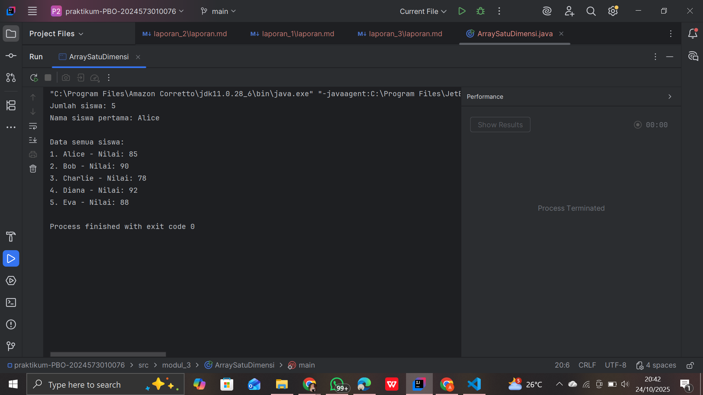
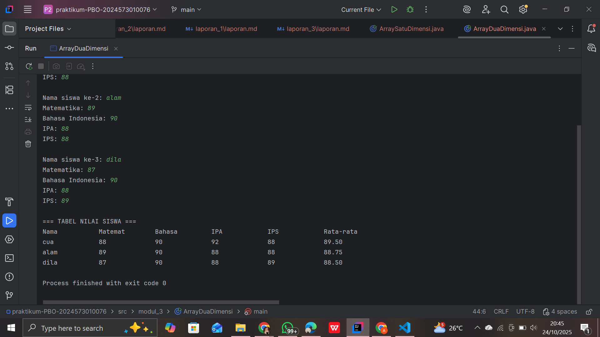
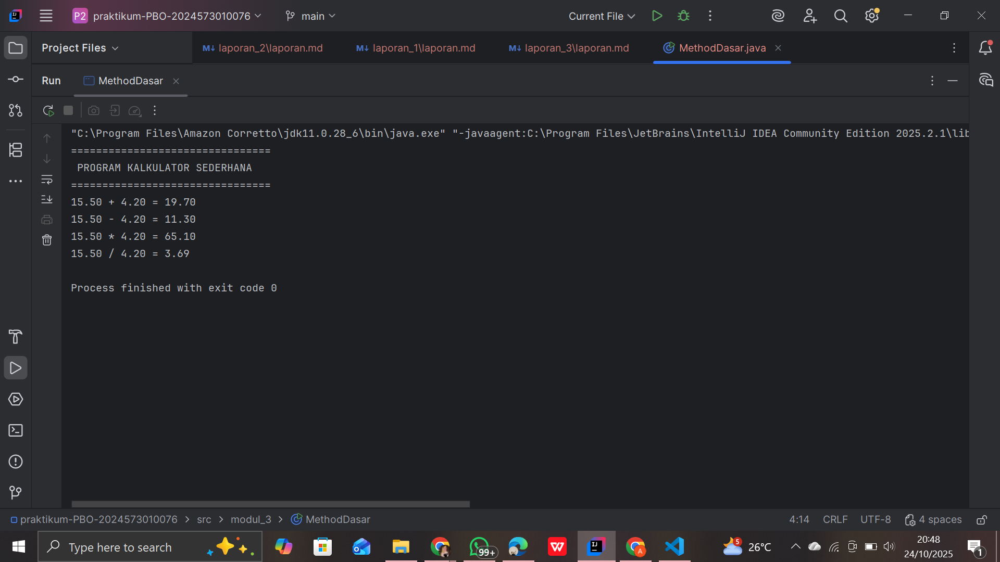
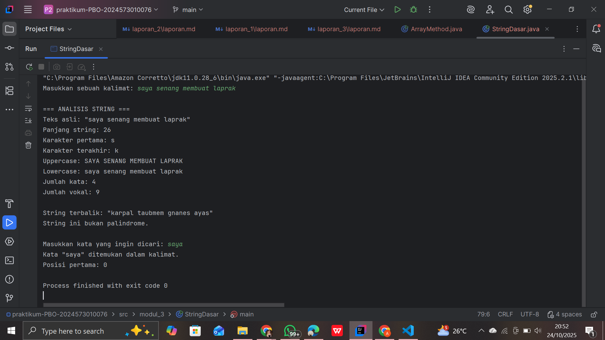
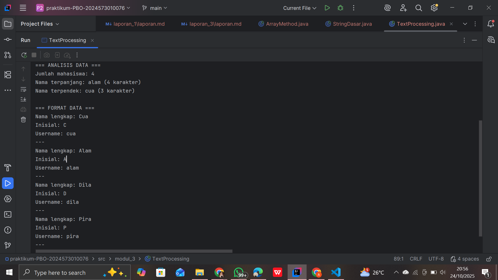

# Laporan Modul 3: Dasar Pemrograman Java
*Mata Kuliah:* Praktikum Pemrograman Berorientasi Objek

*Nama:* **Nasywa Nurshabira**  
*NIM:* **2024573010076**  
*Kelas:* TI 2A

---
## 1. Abstrak

Modul ini membahas dasar pemrograman menggunakan bahasa Java dengan fokus pada tiga topik utama, yaitu **Array**, **Method**, dan **String**.  
Ketiga konsep ini menjadi fondasi penting dalam pengembangan program yang efisien, terstruktur, dan mudah dipelihara.

Melalui praktikum ini, mahasiswa mempelajari cara menyimpan dan mengelola data dengan array, membuat program modular menggunakan method, serta memproses data teks dengan class String dan berbagai fungsinya.  
Pemahaman terhadap konsep ini menjadi dasar penting sebelum mempelajari pemrograman berorientasi objek secara lebih mendalam.

---

## 2. Praktikum

### Praktikum 1 - Array
### 1.1 ArraySatuDimensi
##### Dasar Teori
Array merupakan struktur data yang digunakan untuk menyimpan beberapa nilai dengan tipe data yang sama dalam satu variabel.  
Dengan array, data dapat dikelola secara sistematis dan diakses menggunakan indeks.  
Array dapat berbentuk satu dimensi (seperti daftar nilai) atau dua dimensi (seperti tabel).  
Konsep array sangat penting karena membantu penghematan memori dan mempermudah pengolahan data dalam jumlah besar.

#### Langkah Praktikum
1. Buat project baru

   Buat sebuah project dengan nama yang sesuai, misalnya Modul_3.
2. Buat package baru

   Buat package bernama modul_3 untuk menyimpan file program. Package digunakan untuk mengelompokkan kelas dalam struktur yang teratur.
3. Buat file Java baru

   Di dalam package modul_3, buat sebuah file baru dengan nama ArraySatuDimensi.java
4. Deklarasikan kelas dan method utama
5. Deklarasi dan inisialisasi array

   Buat dua buah array:

   nilai (tipe int) untuk menyimpan data nilai siswa.

   nama (tipe String) untuk menyimpan nama siswa.

6. Menampilkan panjang array

   Gunakan properti .length untuk mengetahui jumlah elemen pada array:
7. Mengakses elemen array secara langsung

   Tampilkan elemen tertentu menggunakan indeks, misalnya elemen pertama (indeks ke-0):
8. Menampilkan seluruh elemen array menggunakan perulangan for

   Gunakan perulangan untuk menampilkan semua data nama dan nilai siswa:
9. Jalankan program

   Simpan file, kemudian jalankan program.

#### Screenshoot Hasil

### 1.2 Array Dua Dimensi
#### Dasar Teori
Array dua dimensi adalah salah satu bentuk lanjutan dari struktur data array satu dimensi, di mana data disusun dalam baris dan kolom menyerupai tabel atau matriks. Jika array satu dimensi hanya memiliki satu indeks untuk mengakses setiap elemen, maka pada array dua dimensi digunakan dua indeks, yaitu indeks baris dan indeks kolom. Dengan kata lain, array dua dimensi adalah array dari array, yang memungkinkan penyimpanan data dalam bentuk grid atau kotak.

Secara konseptual, array dua dimensi dapat dibayangkan seperti tabel dengan beberapa baris dan beberapa kolom. Setiap elemen di dalam array terletak pada posisi tertentu yang ditentukan oleh koordinat baris dan kolom. Misalnya, array [0] [0] menunjukkan elemen yang berada di baris pertama dan kolom pertama, sedangkan array [1] [2] berarti elemen yang berada pada baris kedua dan kolom ketiga.

Array dua dimensi digunakan untuk menyimpan dan mengelola data yang memiliki hubungan dalam dua arah, seperti data tabel nilai mahasiswa (nama vs mata kuliah), data piksel pada gambar, papan permainan (seperti catur), hingga matriks matematika. Karena fleksibilitasnya, array dua dimensi sering dipakai dalam berbagai aplikasi yang memerlukan representasi data dalam bentuk baris dan kolom.
#### Langkah Praktikum
1. Buat file Java baru

   Di dalam package tersebut, buat file dengan nama ArrayDuaDimensi.java.
2. Import library Scanner

   Tambahkan baris import java.util.Scanner; di bagian atas untuk memungkinkan input dari pengguna melalui keyboard.
3. Deklarasi kelas dan method utama
4. Deklarasi array dua dimensi dan array pendukung

    Buat array dua dimensi nilaiSiswa[3][4] untuk menyimpan nilai 3 siswa terhadap 4 mata pelajaran.

    Buat array satu dimensi namaSiswa[3] untuk menyimpan nama siswa.

    Buat array mataPelajaran untuk menampung daftar nama mata pelajaran.
5. Input data siswa dan nilai

   Gunakan perulangan for bersarang (nested loop) untuk menginput nama dan nilai siswa:
6. Menghitung rata-rata nilai setiap siswa

   Untuk setiap siswa, jumlahkan seluruh nilai kemudian bagi dengan jumlah mata pelajaran (4):
7. Jalankan program

#### Screenshoot Hasil

#### Analisa dan Pembahasan
Pada praktikum ini, mahasiswa mempelajari dan menerapkan konsep dasar struktur data Array dalam bahasa pemrograman Java, baik satu dimensi maupun dua dimensi.
Pada Array satu dimensi, program dibuat untuk menyimpan dan menampilkan data nama serta nilai siswa. Setiap data disimpan dalam indeks yang berurutan, sehingga memudahkan pengaksesan dan pengolahan data menggunakan perulangan for. Dengan memanfaatkan properti .length, program dapat mengetahui jumlah elemen array tanpa perlu menghitung manual. Hasil percobaan menunjukkan bahwa array satu dimensi sangat efisien untuk menyimpan kumpulan data sejenis yang tersusun secara linear.
Sedangkan pada Array dua dimensi, konsepnya diperluas menjadi bentuk tabel yang terdiri dari baris dan kolom. Implementasi program ini menggunakan nested loop (perulangan bersarang) untuk menginput dan menampilkan data nilai siswa berdasarkan beberapa mata pelajaran. Dengan array dua dimensi, setiap elemen dapat diakses menggunakan dua indeks — baris untuk nama siswa dan kolom untuk mata pelajaran.   
Dari hasil percobaan, diperoleh pemahaman bahwa:

Array satu dimensi cocok digunakan untuk data berurutan seperti daftar nilai atau nama siswa.

Array dua dimensi ideal digunakan untuk data tabular yang memiliki hubungan dua arah (misalnya, siswa dan mata pelajaran).

Penggunaan array menjadikan program lebih efisien, terstruktur, dan mudah dikembangkan dibandingkan dengan penggunaan banyak variabel terpisah.

---
### Praktikum 2 - Method
### 2.1 Method Dasar
#### Dasar Teori
Method adalah blok kode yang digunakan untuk menjalankan tugas tertentu dan dapat dipanggil berulang kali.  
Fungsi utama method yaitu membuat program lebih **terstruktur, modular, dan efisien**.  
Terdapat dua jenis method:
- **Void** → tidak mengembalikan nilai.
- **Non-Void** → mengembalikan nilai hasil perhitungan atau proses tertentu.

Dengan method, programmer dapat menghindari pengulangan kode dan mempermudah proses debugging.

#### Langkah Praktikum
1. Buat file Java baru

Di dalam package tersebut, buat file dengan nama MethodDasar.java
2. Deklarasikan kelas utama dan method main()
3. Buat method tanpa parameter dan tanpa nilai kembali (void)

   Method ini berfungsi menampilkan header program.
4. Buat method void dengan parameter

   Method ini menerima beberapa parameter untuk menampilkan hasil operasi perhitungan.
5. Buat method dengan nilai kembali (return value)

   Buat beberapa method untuk operasi dasar aritmatika: penjumlahan, pengurangan, perkalian, dan pembagian.
6. Tambahkan method untuk validasi input

   Method ini memeriksa apakah angka valid (bukan NaN atau tak hingga).
7. Gunakan semua method di dalam main()

   Di dalam method main(), panggil semua method yang sudah dibuat untuk dijalankan secara berurutan
8. Jalankan program

#### Screenshoot Hasil

### 2.2 Method Array
#### Dasar Teori
Dalam pemrograman, method dan array merupakan dua konsep dasar yang saling berkaitan dan sering digunakan bersamaan untuk memudahkan pengelolaan serta pengolahan data.

Kombinasi antara method dan array memungkinkan programmer untuk mengelola data dalam jumlah besar dengan lebih mudah. Misalnya, method dapat digunakan untuk menampilkan isi array, menghitung rata-rata nilai dari elemen array, mencari elemen tertentu, atau melakukan operasi matematika pada seluruh isi array. Dengan demikian, penggunaan method membantu menghindari pengulangan kode dan meningkatkan efisiensi program.

#### Langkah Praktikum
1. Buat file Java baru

   Di dalam package tersebut, buat file dengan nama ArrayMethod.java.
2. Import library Scanner

   Tambahkan perintah berikut di bagian atas program untuk menerima input dari pengguna:
3. Buat class utama dan method main()
4. Buat method untuk input array

   Method ini berfungsi meminta pengguna memasukkan sejumlah nilai ke dalam array.
5. Buat method untuk menampilkan isi array

   Method ini menampilkan semua elemen array dalam satu baris.
6. Buat method untuk mencari nilai maksimum dan minimum

   Method ini mencari nilai tertinggi dan terendah dalam array.
7. Buat method untuk menghitung rata-rata

   Method ini menjumlahkan seluruh elemen lalu membaginya dengan jumlah elemen array.
8. Buat method untuk mengurutkan array

   Method ini menggunakan algoritma Bubble Sort untuk menyusun elemen dari kecil ke besar.
9. Gunakan semua method di dalam main()

   Jalankan semua fungsi di method utama agar program bisa menganalisis isi array.
10. Jalankan program

#### Screenshoot Hasil

#### Analisa dan Pembahasan
Pada praktikum ini, mahasiswa mempelajari konsep dasar method dalam bahasa pemrograman Java dan penerapannya dalam membangun program yang terstruktur.
Tujuan utama percobaan ini adalah agar mahasiswa memahami cara mendefinisikan, memanggil, serta mengelola method dengan atau tanpa parameter, dan dengan atau tanpa nilai kembalian (return value).

Pada percobaan Method Dasar, mahasiswa membuat beberapa method seperti:

Method tanpa parameter dan tanpa nilai kembali (void) untuk menampilkan header program.

Method dengan parameter untuk menampilkan hasil operasi aritmatika.

Method dengan nilai kembalian (return) untuk menghitung hasil operasi seperti penjumlahan, pengurangan, perkalian, dan pembagian.

Selain itu, digunakan juga method tambahan untuk validasi input, guna memastikan bahwa data yang diolah valid dan tidak menyebabkan error selama program dijalankan.
Hasil percobaan menunjukkan bahwa penggunaan method membuat program lebih modular, mudah dibaca, serta mudah dikelola karena setiap fungsi dikelompokkan berdasarkan tujuannya masing-masing.

Pada percobaan Method Array, konsep method diterapkan untuk mengolah data array.
Beberapa method dibuat untuk melakukan operasi pada array, seperti:

Menginput data ke dalam array.

Menampilkan isi array secara terstruktur.

Mencari nilai maksimum dan minimum.

Menghitung nilai rata-rata.

Mengurutkan data menggunakan Bubble Sort.

Dengan menggabungkan method dan array, program menjadi lebih efisien karena setiap operasi dilakukan oleh method khusus tanpa perlu menulis ulang logika yang sama.
Penerapan method dalam pengolahan array juga melatih kemampuan berpikir logis dan terstruktur, serta memperkuat konsep reusability (kode yang dapat digunakan kembali).
---
### Praktikum 3 - String
### 3.1 String Dasar
#### Dasar Teori
String adalah kumpulan karakter yang digunakan untuk menyimpan data berbentuk teks.  
Dalam Java, String termasuk dalam kelas bawaan (`java.lang.String`) sehingga memiliki banyak method, seperti:
- `length()` → menghitung panjang teks
- `substring()` → mengambil sebagian teks
- `toUpperCase()` / `toLowerCase()` → mengubah huruf besar/kecil
- `equals()` → membandingkan dua string

Pemahaman tentang manipulasi String sangat penting karena hampir semua aplikasi memerlukan pengolahan data teks.

#### Langkah Praktikum
1. Buat file Java baru

   Buat file bernama StringDasar.java di dalam package tersebut.
2. Import library Scanner

   Tambahkan library berikut di bagian atas program untuk menerima input dari pengguna
3. Buat method analisisString()

   Method ini berfungsi untuk menampilkan informasi dasar dari string, seperti panjang karakter, huruf pertama, huruf terakhir, huruf besar, huruf kecil, jumlah kata, dan jumlah huruf vokal.
4. Buat method hitungVokal()

   Method ini menghitung jumlah huruf vokal (a, i, u, e, o) dari sebuah kalimat.
5. Buat method reverseString()

   Method ini digunakan untuk membalik urutan karakter dalam string.
6. Buat method isPalindrome()

   Method ini digunakan untuk mengecek apakah sebuah kalimat merupakan palindrome (dibaca sama dari depan maupun belakang).
7. Tulis method main() untuk menjalankan semua fungsi
8. Jalankan program

#### Screenshoot Hasil

### 3.2 Text Processing
#### Dasar Teori
Text Processing atau pemrosesan teks adalah suatu teknik dalam pemrograman yang digunakan untuk membaca, menganalisis, memanipulasi, dan mengolah data berbentuk teks. Dalam dunia komputer, sebagian besar informasi disimpan dalam bentuk teks — seperti dokumen, pesan, data log, atau masukan pengguna — sehingga kemampuan untuk mengolah teks menjadi hal yang sangat penting.

Dalam pemrograman, pemrosesan teks biasanya melibatkan operasi seperti pencarian kata atau karakter, penggantian teks, penghitungan jumlah kata, pemisahan kalimat, penghapusan tanda baca, hingga pemeriksaan pola tertentu menggunakan regular expression (regex). Dengan text processing, program dapat mengambil informasi penting dari teks mentah dan mengubahnya menjadi data yang lebih terstruktur dan mudah dianalisis.

#### Langkah Praktikum
1. Buat file Java baru

   Di dalam package tersebut, buat file baru dengan nama TextProcessing.java.
2. Import library Scanner

   Tambahkan baris berikut di bagian atas kode untuk menerima input dari pengguna:
3. Buat method prosesDataMahasiswa()
4. Analisis nama terpanjang dan terpendek

   Gunakan perulangan for untuk mencari nama dengan jumlah karakter paling banyak dan paling sedikit
5. Buat method formatTitleCase()

   Method ini mengubah setiap nama menjadi format huruf besar di awal kata.
6. Buat method buatInisial()

   Method ini mengambil huruf pertama dari setiap kata dalam nama untuk dijadikan inisial.
7. Buat method buatUsername()

   Method ini membuat username berdasarkan kata pertama dari nama mahasiswa.
8. Panggil semua method di dalam main()

   Program meminta pengguna memasukkan daftar nama yang dipisahkan dengan koma, lalu memproses data menggunakan method-method di atas.
9. Jalankan program

#### Screenshoot Hasil

#### Analisa dan hasil
Pada praktikum ini, mahasiswa mempelajari konsep String dan Text Processing dalam bahasa pemrograman Java.
String merupakan kumpulan karakter yang berfungsi untuk menyimpan dan memanipulasi teks, sedangkan text processing adalah penerapan lanjutan untuk menganalisis dan mengelola data berbasis teks dalam skala yang lebih kompleks.

String Dasar

Pada percobaan ini, mahasiswa membuat beberapa method untuk mengelola dan menganalisis teks, seperti:

length() untuk menghitung panjang string.

substring() untuk mengambil sebagian teks.

toUpperCase() dan toLowerCase() untuk mengubah bentuk huruf.

equals() untuk membandingkan dua string.

Selain itu, mahasiswa juga mengimplementasikan method tambahan seperti:

hitungVokal() → menghitung jumlah huruf vokal dalam kalimat.

reverseString() → membalik urutan karakter pada string.

isPalindrome() → memeriksa apakah kalimat yang dimasukkan merupakan palindrome (dibaca sama dari depan maupun belakang).

Hasil praktikum menunjukkan bahwa pemrosesan string di Java dapat dilakukan dengan mudah menggunakan berbagai method bawaan dari class String. Hal ini membuat manipulasi teks menjadi efisien tanpa memerlukan struktur data tambahan.

Text Processing

Pada percobaan ini, mahasiswa memperluas konsep manipulasi string dengan mengolah kumpulan teks yang lebih kompleks. Program dibuat untuk menerima daftar nama mahasiswa, kemudian diproses melalui beberapa tahap seperti:

Menentukan nama terpanjang dan terpendek menggunakan perulangan dan fungsi length().

Mengubah format menjadi Title Case (huruf besar di awal setiap kata).

Membuat inisial nama dengan mengambil huruf pertama dari tiap kata.

Membangun username otomatis berdasarkan nama yang diinput pengguna.

Dari hasil percobaan, dapat dilihat bahwa text processing memungkinkan program untuk membaca, menganalisis, dan memodifikasi teks dengan tingkat fleksibilitas tinggi. Proses ini sangat penting dalam berbagai aplikasi seperti pendaftaran pengguna, analisis dokumen, dan sistem pencarian data.

---
## 4. Kesimpulan

Dari praktikum yang telah dilakukan, dapat disimpulkan bahwa **Array**, **Method**, dan **String** merupakan komponen dasar yang saling melengkapi dalam pemrograman Java.
- **Array** memudahkan penyimpanan dan pengelolaan data dalam jumlah besar.
- **Method** membantu pembuatan program yang lebih terorganisir dan mudah dikembangkan.
- **String** memungkinkan manipulasi data teks secara fleksibel.

Dengan menguasai ketiga konsep ini, mahasiswa dapat memahami dasar-dasar penting pemrograman yang menjadi pondasi untuk mempelajari **pemrograman berorientasi objek (OOP)** dan berbagai konsep lanjutan lainnya.

---
## 5. Referensi

1. Duniailkom. *Tutorial Belajar Java: Tipe Data Array dalam Bahasa Pemrograman Java.*  
   Diakses dari: https://www.duniailkom.com/tutorial-belajar-java-tipe-data-array-bahasa-pemrograman-java/

2. Petani Kode. *Belajar Java: Mengenal Array di Java.*  
   Diakses dari: https://www.petanikode.com/java-array/

3. W3Schools. *Java Methods and Strings Tutorial.*  
   Diakses dari: https://www.w3schools.com/java/

4. Tutorialspoint. *Java Methods.*  
   Diakses dari: https://www.tutorialspoint.com/java/java_methods.htm

5. Modul Praktikum Java – HackMD (mohdrzu). *Modul Praktikum 3: Array, Method, dan String.*  
   Diakses dari: https://hackmd.io/@mohdrzu/BJBWepc3xg
