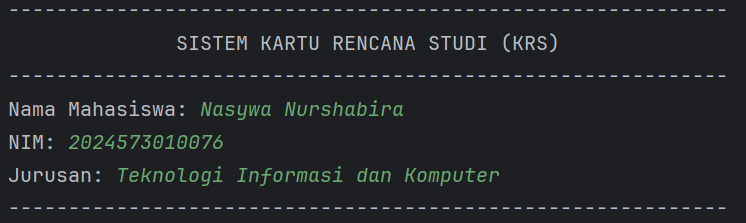
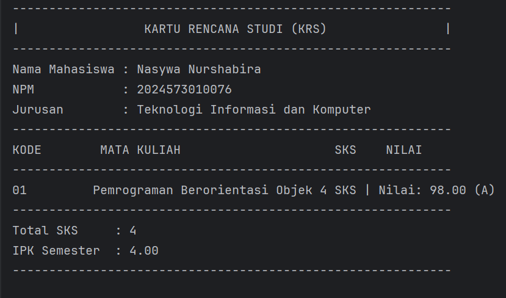
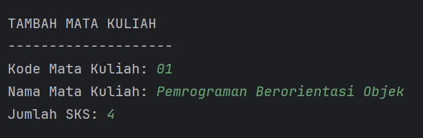

# Laporan Modul 4: Pengenalan Object Oriented Programming 
**Mata Kuliah:** Praktikum Pemrograman Berorientasi Objek   
**Nama:** Nasywa Nurshabira     
**NIM:** 2024573010076  
**Kelas:** TI 2A
---

## 1. Abstrak
Praktikum ini bertujuan untuk memperkenalkan paradigma pemrograman berorientasi objek (Object Oriented Programming – OOP) menggunakan bahasa pemrograman Java.  
Melalui modul ini, mahasiswa belajar konsep dasar OOP seperti *class*, *object*, *attribute/field*, *method*, dan *constructor*, serta empat prinsip utama OOP: *encapsulation*, *inheritance*, *polymorphism*, dan *abstraction*.

Dalam praktiknya, mahasiswa membuat beberapa kelas seperti `Mahasiswa`, `MataKuliah`, `RencanaKartuStudi`, dan `Main`, kemudian menjalankan dan melakukan modifikasi pada kode: menambahkan fitur penghapusan mata kuliah dari KRS, validasi jumlah SKS maksimal (misalnya 24 SKS), serta metode untuk menampilkan mata kuliah dengan nilai terbaik dan terburuk.

Dengan demikian, diharapkan mahasiswa memahami bagaimana objek dibuat dari kelas, bagaimana kelas dan objek berinteraksi, serta bagaimana penerapan OOP dapat meningkatkan modularitas, keterbacaan, dan pemeliharaan kode.

**Kata kunci:** OOP, Java, class, object, encapsulation, inheritance, polymorphism, abstraction.

---
## 2. Praktikum
### Dasar class dan object
#### Dasar Teori
Pemrograman Berorientasi Objek (*Object Oriented Programming* atau OOP) merupakan paradigma pemrograman yang berfokus pada penggunaan objek dalam membangun suatu program.  
Objek di sini adalah entitas yang memiliki data (dalam bentuk atribut) dan perilaku (dalam bentuk metode).  
Paradigma OOP bertujuan untuk membuat program lebih terstruktur, mudah dipahami, serta mudah dikembangkan dan dipelihara.

Berbeda dengan pemrograman prosedural yang menekankan urutan langkah-langkah eksekusi, OOP memodelkan sistem berdasarkan hubungan antar objek yang berinteraksi satu sama lain.  
Java merupakan salah satu bahasa pemrograman yang sepenuhnya mendukung konsep OOP, sehingga sangat sering digunakan dalam pembelajaran dasar OOP.

#### *Konsep Utama OOP*

1. **Kelas (*Class*)**  
   Kelas merupakan cetak biru (*blueprint*) dari objek.  
   Di dalam kelas didefinisikan atribut (variabel) dan metode (fungsi) yang akan dimiliki oleh objek.

2. **Objek (*Object*)**  
   Objek adalah instansi dari kelas.  
   Setiap objek memiliki karakteristik (nilai atribut) dan perilaku (metode) sesuai definisi kelasnya.

3. **Atribut / Field**  
   Atribut adalah variabel yang digunakan untuk menyimpan data atau informasi dari suatu objek.

4. **Metode (*Method*)**  
   Metode berisi perintah atau fungsi yang mendefinisikan perilaku dari objek.

5. **Konstruktor (*Constructor*)**  
   Konstruktor adalah metode khusus yang dipanggil saat objek dibuat.  
   Konstruktor biasanya digunakan untuk menginisialisasi nilai awal atribut.

---

#### *Prinsip-Prinsip Dasar OOP*

1. **Enkapsulasi (*Encapsulation*)**  
   Merupakan penyembunyian detail implementasi dari sebuah objek agar hanya bagian tertentu yang dapat diakses.  
   Dengan enkapsulasi, data menjadi lebih aman karena akses terhadap atribut dapat dikendalikan melalui metode seperti *getter* dan *setter*.

2. **Pewarisan (*Inheritance*)**  
   Adalah kemampuan suatu kelas untuk mewarisi atribut dan metode dari kelas lain.  
   Hal ini bertujuan untuk meminimalkan pengulangan kode dan memudahkan pengembangan program.

3. **Polimorfisme (*Polymorphism*)**  
   Polimorfisme memungkinkan satu metode memiliki banyak bentuk perilaku tergantung pada objek yang memanggilnya.  
   Contohnya, metode yang sama dapat memberikan hasil berbeda pada kelas turunan yang berbeda.

4. **Abstraksi (*Abstraction*)**  
   Abstraksi berarti menyembunyikan detail yang tidak perlu dan hanya menampilkan fitur penting dari suatu objek.  
   Hal ini membantu dalam menyederhanakan kompleksitas program.

---

#### Langkah Praktikum
1. Buat class Mahasiswa dan isikan kode berikut:

        package modul_4;

         public class Mahasiswa {
        // Atribut/Field (private untuk encapsulation)
            private String nama;
         private String nim;
         private String jurusan;

        // Constructor dengan parameter
        public Mahasiswa(String nama, String npm, String jurusan, double ipk) {
            this.nama = nama;
            this.nim = npm;
            this.jurusan = jurusan;
        }

        // Getter methods
        public String getNama() {
            return nama;
        }

        public String getNim() {
            return nim;
        }

        public String getJurusan() {
            return jurusan;
        }
         }

2. Buat class Matakuliah dan isikan kode berikut:

        package modul_4;
        
        public class Matakuliah {
        private String kode;
        private String nama;
        private int sks;
        private double nilai;

        // Constructor
        public Matakuliah(String kode, String nama, int sks) {
            this.kode = kode;
            this.nama = nama;
            this.sks = sks;
            this.nilai = 0.0;
        }

        // Getter dan Setter
        public String getKode() {
            return kode;
        }

        public String getNama() {
            return nama;
        }

        public int getSks() {
            return sks;
        }

        public double getNilai() {
            return nilai;
        }

        public void setNilai(double nilai) {
            if (nilai >= 0.0 && nilai <= 100.0) {
                this.nilai = nilai;
            } else {
                System.out.println("Nilai harus antara 0-100");
            }
        }

        // Konversi nilai angka ke huruf
        public String getNilaiHuruf() {
            if (nilai > 85) return "A";
            else if (nilai > 80) return "A-";
            else if (nilai > 75) return "B+";
            else if (nilai > 70) return "B";
            else if (nilai > 65) return "B-";
            else if (nilai > 60) return "C+";
            else if (nilai > 55) return "C";
            else if (nilai > 50) return "D";
            else return "E";
        }

        // Konversi nilai huruf ke bobot
        public double getBobotNilai() {
            String huruf = getNilaiHuruf();
            switch (huruf) {
                case "A": return 4.0;
                case "A-": return 3.7;
                case "B+": return 3.3;
                case "B": return 3.0;
                case "B-": return 2.7;
                case "C+": return 2.3;
                case "C": return 2.0;
                case "D": return 1.0;
                default: return 0.0;
            }
        }

        public void tampilkanInfo() {
            System.out.printf("%-10s %-30s %d SKS | Nilai: %.2f (%s)\n",
                    kode, nama, sks, nilai, getNilaiHuruf());
        }
         }
3. Buat class RencanaKartuStudi dan isikan kode berikut:

         package modul_4;

         public class RencanaKartuStudi {
          private Mahasiswa mahasiswa;
         private Matakuliah[] daftarMatakuliah;
         private int jumlahMatkul;
         private int maxMatkul;
         private final int BATAS_SKS = 24; // Batas total SKS

        public RencanaKartuStudi(Mahasiswa mahasiswa, int maxMatkul) {
            this.mahasiswa = mahasiswa;
            this.maxMatkul = maxMatkul;
            this.daftarMatakuliah = new Matakuliah[maxMatkul];
            this.jumlahMatkul = 0;
        }
    
        // Menambah mata kuliah ke KRS (dengan validasi total SKS)
        public void tambahMatakuliah(Matakuliah matkul) {
            int totalBaru = getTotalSKS() + matkul.getSks();

        if (jumlahMatkul >= maxMatkul) {
            System.out.println("KRS sudah penuh! Maksimal " + maxMatkul + " mata kuliah.");
        } else if (totalBaru > BATAS_SKS) {
            System.out.println(" Gagal menambah. Total SKS melebihi batas " + BATAS_SKS + ".");
        } else {
            daftarMatakuliah[jumlahMatkul] = matkul;
            jumlahMatkul++;
            System.out.println(" Mata kuliah " + matkul.getNama() + " berhasil ditambahkan.");
        }
            }
        
            // Menghapus mata kuliah berdasarkan kode
            public void hapusMatakuliah(String kode) {
                boolean ditemukan = false;
                for (int i = 0; i < jumlahMatkul; i++) {
                    if (daftarMatakuliah[i].getKode().equalsIgnoreCase(kode)) {
                        ditemukan = true;
                        System.out.println(" Mata kuliah " + daftarMatakuliah[i].getNama() + " dihapus dari KRS.");
                        // Geser elemen ke kiri untuk menutup celah
                        for (int j = i; j < jumlahMatkul - 1; j++) {
                            daftarMatakuliah[j] = daftarMatakuliah[j + 1];
                        }
                        daftarMatakuliah[jumlahMatkul - 1] = null;
                        jumlahMatkul--;
                        break;
                    }
                }
                if (!ditemukan) {
                    System.out.println(" Mata kuliah dengan kode " + kode + " tidak ditemukan.");
                }
            }
        
            // Menghitung total SKS
            public int getTotalSKS() {
                int total = 0;
                for (int i = 0; i < jumlahMatkul; i++) {
                    total += daftarMatakuliah[i].getSks();
                }
                return total;
            }
        
            // Menghitung IPS sementara
            public double hitungIPS() {
                double totalBobot = 0.0;
                double totalSKS = getTotalSKS();

        if (jumlahMatkul == 0) return 0.0;

        for (int i = 0; i < jumlahMatkul; i++) {
            totalBobot += daftarMatakuliah[i].getBobotNilai() * daftarMatakuliah[i].getSks();
        }

        return totalSKS > 0 ? totalBobot / totalSKS : 0.0;
        }
    
        // Menampilkan data KRS
        public void tampilkanKRS() {
            System.out.println("============================================");
            System.out.println("           KARTU RENCANA STUDI (KRS)");
            System.out.println("============================================");
            System.out.println("NIM   : " + mahasiswa.getNim());
            System.out.println("Nama  : " + mahasiswa.getNama());
            System.out.println("Prodi : " + mahasiswa.getJurusan());
            System.out.println("--------------------------------------------");
            System.out.printf("%-10s %-30s %s\n", "Kode", "Nama Mata Kuliah", "SKS NILAI");
            System.out.println("--------------------------------------------");

        for (int i = 0; i < jumlahMatkul; i++) {
            daftarMatakuliah[i].tampilkanInfo();
        }

        System.out.println("--------------------------------------------");
        System.out.println("Total SKS: " + getTotalSKS());
        System.out.printf("IPS Semester Ini: %.2f\n", hitungIPS());
        System.out.println("============================================\n");
        }
    
        // Mencari mata kuliah berdasarkan kode
        public Matakuliah cariMatakuliah(String kode) {
            for (int i = 0; i < jumlahMatkul; i++) {
                if (daftarMatakuliah[i].getKode().equalsIgnoreCase(kode)) {
                    return daftarMatakuliah[i];
                }
            }
            return null;
        }
    
        // Menampilkan mata kuliah dengan nilai terbaik
        public void tampilkanNilaiTerbaik() {
            if (jumlahMatkul == 0) {
                System.out.println("Belum ada mata kuliah dalam KRS.");
                return;
            }

        Matakuliah terbaik = daftarMatakuliah[0];
        for (int i = 1; i < jumlahMatkul; i++) {
            if (daftarMatakuliah[i].getNilai() > terbaik.getNilai()) {
                terbaik = daftarMatakuliah[i];
            }
        }
        System.out.println(" Mata kuliah dengan nilai terbaik: " + terbaik.getNama() +
                " (" + terbaik.getNilai() + " - " + terbaik.getNilaiHuruf() + ")");
        }
    
        // Menampilkan mata kuliah dengan nilai terburuk
        public void tampilkanNilaiTerburuk() {
            if (jumlahMatkul == 0) {
                System.out.println("Belum ada mata kuliah dalam KRS.");
                return;
            }

        Matakuliah terburuk = daftarMatakuliah[0];
        for (int i = 1; i < jumlahMatkul; i++) {
            if (daftarMatakuliah[i].getNilai() < terburuk.getNilai()) {
                terburuk = daftarMatakuliah[i];
            }
        }
        System.out.println(" Mata kuliah dengan nilai terburuk: " + terburuk.getNama() +
                " (" + terburuk.getNilai() + " - " + terburuk.getNilaiHuruf() + ")");
            }
        }
4. Buat class Main untuk menguji:

        package modul_4;

        import java.util.Scanner;
    
        public class Main {
            public static void main(String[] args) {
                Scanner input = new Scanner(System.in);

            System.out.println("------------------------------------------------------------");
            System.out.println("           SISTEM KARTU RENCANA STUDI (KRS)                ");
            System.out.println("------------------------------------------------------------");

            // Input data mahasiswa
            System.out.print("Nama Mahasiswa: ");
            String nama = input.nextLine();

            System.out.print("NIM: ");
            String nim = input.nextLine();

            System.out.print("Jurusan: ");
            String jurusan = input.nextLine();

            // Membuat object mahasiswa
            Mahasiswa mhs = new Mahasiswa(nama, nim, jurusan, 0.0);

            // Membuat object KRS (maksimal 10 mata kuliah)
            RencanaKartuStudi krs = new RencanaKartuStudi(mhs, 10);

            // Menu KRS
            boolean running = true;

            while (running) {
                System.out.println("------------------------------------------------------------");
                System.out.println("                        MENU KRS                            ");
                System.out.println("------------------------------------------------------------");
                System.out.println("| 1. Tambah Mata Kuliah                                   |");
                System.out.println("| 2. Input Nilai Mata Kuliah                              |");
                System.out.println("| 3. Tampilkan KRS                                        |");
                System.out.println("| 4. Keluar                                               |");
                System.out.println("| 5. Hapus Mata Kuliah                                    |");
                System.out.println("| 6. Tampilkan Nilai Terbaik & Terburuk                   |");
                System.out.println("------------------------------------------------------------");
                System.out.print("Pilih menu: ");

                int pilihan = input.nextInt();
                input.nextLine(); // consume newline

                switch (pilihan) {
                    case 1:
                        // Tambah mata kuliah
                        System.out.println("\nTAMBAH MATA KULIAH");
                        System.out.println("--------------------");
                        System.out.print("Kode Mata Kuliah: ");
                        String kode = input.nextLine();

                        System.out.print("Nama Mata Kuliah: ");
                        String namaMK = input.nextLine();

                        System.out.print("Jumlah SKS: ");
                        int sks = input.nextInt();
                        input.nextLine();

                        Matakuliah mk = new Matakuliah(kode, namaMK, sks);
                        krs.tambahMatakuliah(mk);
                        break;

                    case 2:
                        // Input nilai
                        System.out.println("\nINPUT NILAI");
                        System.out.println("--------------------");
                        System.out.print("Kode Mata Kuliah: ");
                        String kodeCari = input.nextLine();

                        Matakuliah mkCari = krs.cariMatakuliah(kodeCari);
                        if (mkCari != null) {
                            System.out.print("Nilai (0-100): ");
                            double nilai = input.nextDouble();
                            mkCari.setNilai(nilai);
                            System.out.println("Nilai berhasil diinput!");
                        } else {
                            System.out.println("Mata kuliah tidak ditemukan!");
                        }
                        break;

                    case 3:
                        // Tampilkan KRS
                        krs.tampilkanKRS();
                        break;

                    case 4:
                        // Keluar
                        System.out.println("Terima kasih!");
                        running = false;
                        break;

                    case 5:
                        System.out.print("Masukkan kode mata kuliah yang ingin dihapus: ");
                        String kodeHapus = input.nextLine();
                        krs.hapusMatakuliah(kodeHapus);
                        break;

                    case 6:
                        krs.tampilkanNilaiTerbaik();
                        krs.tampilkanNilaiTerburuk();
                        break;


                    default:
                        System.out.println("Pilihan tidak valid!");
                }
            }
        }
          }

#### Screenshoot Hasil
*mahasiwa*
      

*kartu rencana studi*
  

*matakuliah*


#### Analisa dan Pembahasan

### 1. Class `Mahasiswa`

```
public class Mahasiswa {
```

* Mendefinisikan kelas `Mahasiswa`, yang merepresentasikan data seorang mahasiswa.
* Kelas ini berfungsi sebagai blueprint objek mahasiswa.

```
private String nama;
private String nim;
private String jurusan;
```

* Ketiga variabel tersebut adalah atribut milik objek mahasiswa.
* Bersifat `private`, artinya hanya bisa diakses di dalam kelas itu sendiri.
* Merupakan contoh **Encapsulation** dalam konsep OOP.

```java
public Mahasiswa(String nama, String npm, String jurusan, double ipk) {
    this.nama = nama;
    this.nim = npm;
    this.jurusan = jurusan;
}
```

* Constructor digunakan untuk menginisialisasi objek mahasiswa baru.
* Parameter berupa `nama`, `npm`, dan `jurusan`.

```java
public String getNama() { return nama; }
public String getNim() { return nim; }
public String getJurusan() { return jurusan; }
```

* Fungsi ini disebut **getter**, digunakan untuk mengambil nilai atribut private dari luar kelas.

---

### 2. Class `Matakuliah`

```
package modul_4;
public class Matakuliah {
```

* Package `modul_4` digunakan untuk mengelompokkan kelas dalam modul.
* `public class Matakuliah` mendefinisikan kelas publik untuk menyimpan data mata kuliah.

```java
private String kode;
private String nama;
private int sks;
private double nilai;
```

* Atribut dengan modifier `private` untuk menjaga enkapsulasi.
* Menyimpan informasi penting: kode, nama, SKS, dan nilai.

```java
public Matakuliah(String kode, String nama, int sks) {
    this.kode = kode;
    this.nama = nama;
    this.sks = sks;
    this.nilai = 0.0;
}
```

* Constructor menginisialisasi objek `Matakuliah` dengan nilai default `0.0`.
* Contoh penerapan **praktek baik OOP** dengan inisialisasi awal.

```java
public void setNilai(double nilai) {
    if (nilai >= 0.0 && nilai <= 100.0) {
        this.nilai = nilai;
    } else {
        System.out.println("Nilai harus antara 0-100");
    }
}
```

* Method setter dengan validasi untuk menjaga agar nilai berada di rentang 0–100.

```java
public String getNilaiHuruf() {
    if (nilai > 85) return "A";
    else if (nilai > 80) return "A-";
    else return "E";
}
```

* Mengonversi nilai angka menjadi huruf berdasarkan rentang.

```java
public double getBobotNilai() {
    String huruf = getNilaiHuruf();
    switch (huruf) {
        case "A": return 4.0;
        case "B": return 3.0;
        default: return 0.0;
    }
}
```

* Mengubah nilai huruf ke bobot IPK untuk perhitungan IPS.

```java
public void tampilkanInfo() {
    System.out.printf("%-10s %-30s %d SKS | Nilai: %.2f (%s)\n",
                      kode, nama, sks, nilai, getNilaiHuruf());
}
```

* Menampilkan data mata kuliah dengan format rapi menggunakan `printf()`.

---

### 3. Class `RencanaKartuStudi`

```java
public RencanaKartuStudi(Mahasiswa mahasiswa, int maxMatkul) {
    this.mahasiswa = mahasiswa;
    this.maxMatkul = maxMatkul;
    this.daftarMatakuliah = new Matakuliah[maxMatkul];
    this.jumlahMatkul = 0;
}
```

* Menginisialisasi objek KRS untuk satu mahasiswa dengan kapasitas maksimum.

```java
public void tambahMatakuliah(Matakuliah matkul) {
    int totalBaru = getTotalSKS() + matkul.getSks();
    if (jumlahMatkul >= maxMatkul) {
        System.out.println("KRS sudah penuh!");
    } else if (totalBaru > BATAS_SKS) {
        System.out.println("Total SKS melebihi batas 24.");
    } else {
        daftarMatakuliah[jumlahMatkul] = matkul;
        jumlahMatkul++;
        System.out.println("Mata kuliah " + matkul.getNama() + " berhasil ditambahkan.");
    }
}
```

* Memastikan KRS tidak melebihi batas jumlah matkul atau SKS maksimal.
* Jika valid, mata kuliah ditambahkan ke daftar.

```java
public double hitungIPS() {
    double totalBobot = 0.0;
    double totalSKS = getTotalSKS();
    for (int i = 0; i < jumlahMatkul; i++) {
        totalBobot += daftarMatakuliah[i].getBobotNilai() * daftarMatakuliah[i].getSks();
    }
    return totalSKS > 0 ? totalBobot / totalSKS : 0.0;
}
```

* Menghitung IPS dengan rumus:

  `IPS = (Σ (bobot × SKS)) / total SKS`

```java
public void tampilkanKRS() {
    System.out.println("============================================");
    System.out.println("           KARTU RENCANA STUDI (KRS)");
    for (int i = 0; i < jumlahMatkul; i++) {
        daftarMatakuliah[i].tampilkanInfo();
    }
    System.out.printf("IPS Semester Ini: %.2f\n", hitungIPS());
}
```

* Menampilkan seluruh daftar mata kuliah dan hasil IPS dengan format tabel.

---

### 4. Class `Main`

```java
import java.util.Scanner;
```

* Mengimpor `Scanner` untuk membaca input dari pengguna.

```java
Scanner input = new Scanner(System.in);
```

* Membuat objek `Scanner` untuk menangkap input pengguna.

```
System.out.print("Nama Mahasiswa: ");
String nama = input.nextLine();
```

* Pengguna memasukkan identitas mahasiswa (nama, NIM, jurusan).

```java
Mahasiswa mhs = new Mahasiswa(nama, nim, jurusan, 0.0);
RencanaKartuStudi krs = new RencanaKartuStudi(mhs, 10);
```

* Membuat objek mahasiswa dan objek KRS untuk menyimpan daftar mata kuliah.

#### Menu Program:

1. **Tambah Mata Kuliah** → menambahkan mata kuliah baru dengan validasi SKS.
2. **Input Nilai** → mencari mata kuliah dan menginput nilai (0–100).
3. **Tampilkan KRS** → menampilkan seluruh data KRS beserta IPS.
4. **Hapus Mata Kuliah** → menghapus mata kuliah berdasarkan kode.
5. **Nilai Terbaik & Terburuk** → menampilkan matkul dengan nilai tertinggi dan terendah.
6. **Keluar Program** → mengakhiri program dengan pesan perpisahan.

---
## 3. Kesimpulan

1. **Konsep Kelas (Class)** merupakan pondasi utama dalam OOP, berfungsi sebagai cetak biru (blueprint) untuk membuat objek yang memiliki atribut dan perilaku tertentu.
2. **Enkapsulasi (Encapsulation)** digunakan untuk melindungi data dengan menjadikan atribut bersifat `private`, sehingga hanya dapat diakses melalui method `getter` dan `setter`.
3. **Constructor** berperan penting untuk menginisialisasi nilai atribut ketika objek pertama kali dibuat.
4. **Objek** merupakan perwujudan nyata dari kelas. Dengan membuat objek, kita dapat mengakses method dan atribut yang telah didefinisikan dalam kelas.
5. Program utama (`Main.java`) menjadi titik awal untuk mengeksekusi seluruh proses, mulai dari pembuatan objek hingga menampilkan data ke layar.

Secara keseluruhan, praktikum ini membantu mahasiswa memahami dasar-dasar **Pemrograman Berorientasi Objek (OOP)** khususnya pada aspek **enkapsulasi dan implementasi kelas**, yang menjadi dasar dalam pengembangan perangkat lunak berskala besar dan terstruktur.

---
## 4. Referensi
1. Nugroho, Adi. *Pemrograman Berorientasi Objek dengan Java*. Bandung: Informatika, 2016.
2. Oracle. (2024). [*The Java™ Tutorials - Object-Oriented Programming Concepts*](https://docs.oracle.com/javase/tutorial/java/concepts/).
3. Modul Praktikum Pemrograman Berorientasi Objek – Politeknik Negeri Lhokseumawe, 2025.
4. Wahana Komputer. *Pemrograman Java untuk Pemula*. Yogyakarta: Andi Publisher, 2020.
5. Tutorialspoint. (2024). [*Java - Object Oriented Programming*](https://www.tutorialspoint.com/java/java_object_classes.htm).
