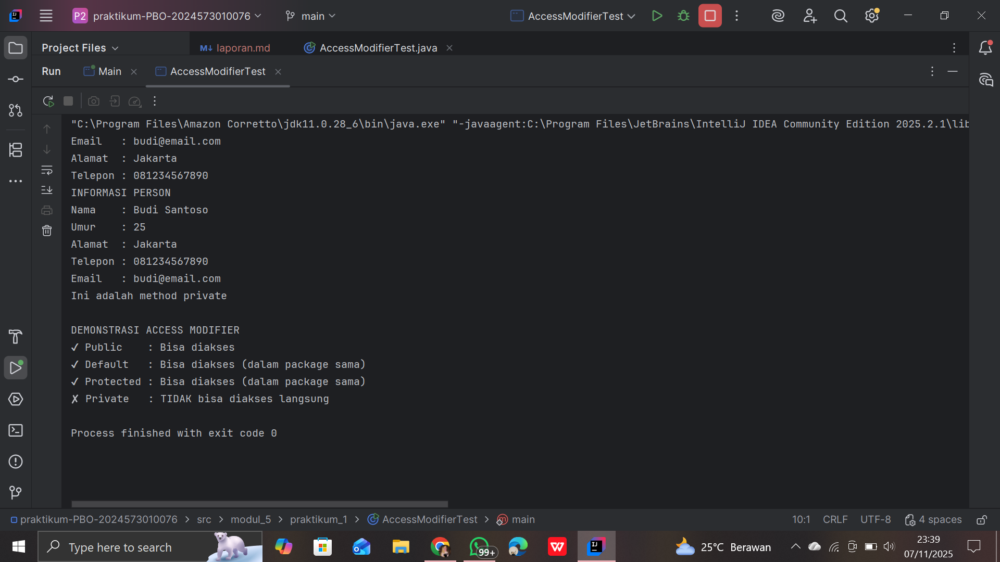
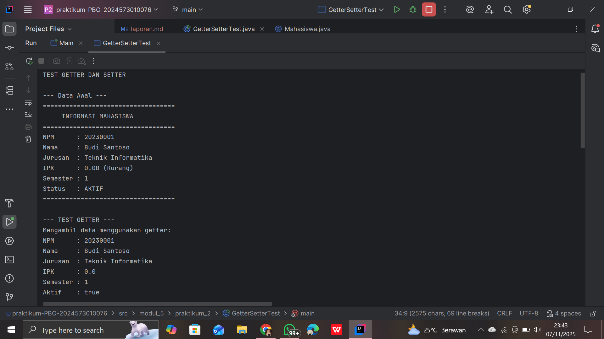
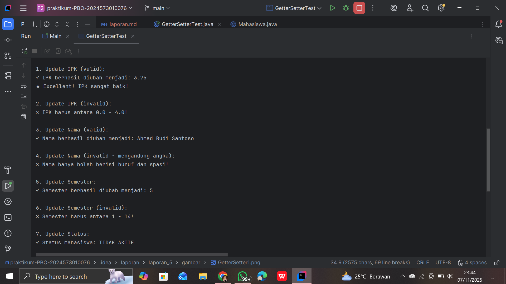
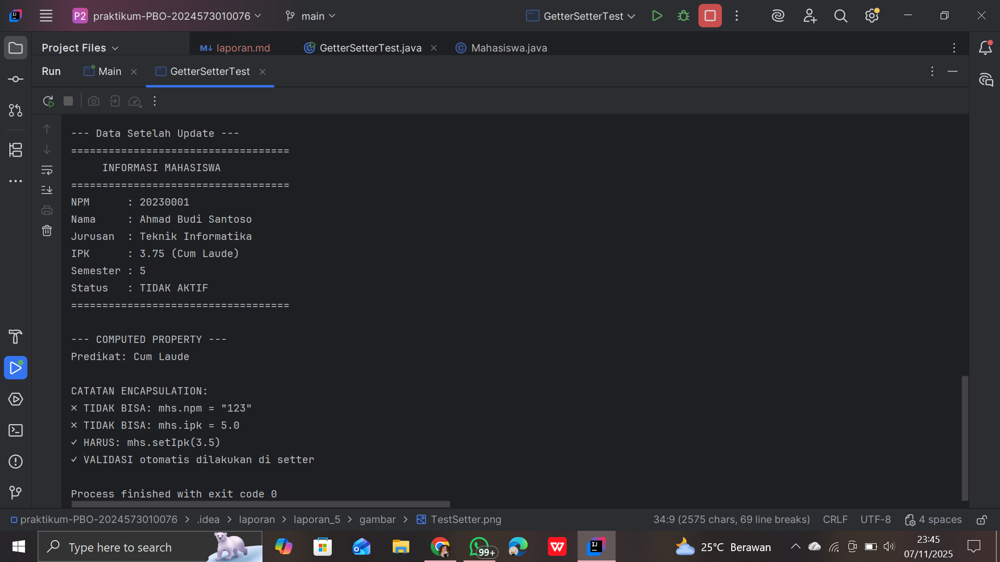
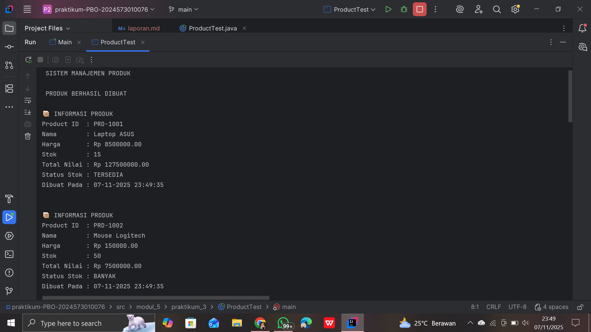
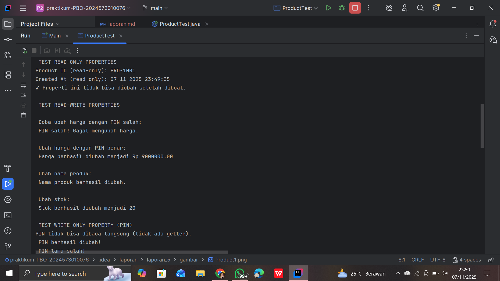
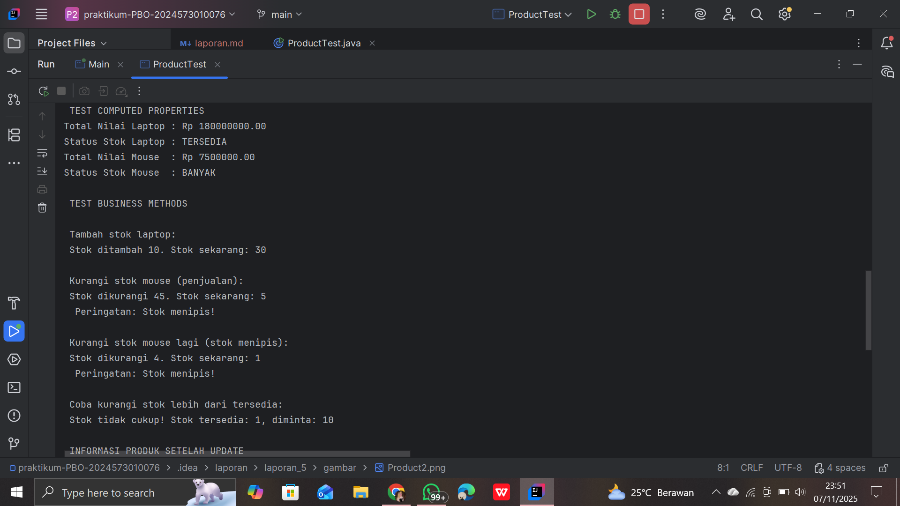
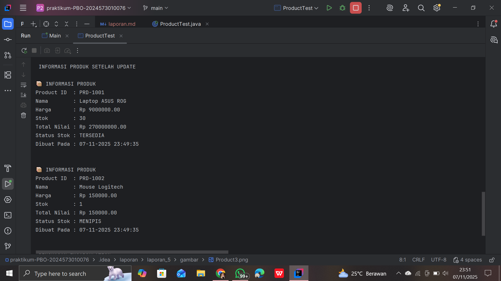

# Laporan Modul 5: Enkapsulasi

#### Mata Kuliah: Praktikum Pemrograman Berorientasi Objek

#### Nama: Nasywa Nurshabira

#### NIM: 2024573010076

#### Kelas: TI 2A


# 1. Abstrak
Praktikum ini membahas penerapan prinsip encapsulation dalam pemrograman berorientasi objek (OOP). Enkapsulasi merupakan mekanisme penyembunyian data yang menggabungkan atribut dan metode dalam satu kesatuan kelas, sehingga data tidak dapat diakses langsung dari luar kelas. Melalui tiga percobaan, yaitu penggunaan access modifier, penerapan getter dan setter, serta implementasi read-only dan write-only properties, mahasiswa dapat memahami bagaimana enkapsulasi menjaga keamanan, konsistensi, dan fleksibilitas data dalam program. Hasil praktikum menunjukkan bahwa penerapan enkapsulasi mampu meningkatkan modularitas kode, kemudahan pemeliharaan, serta mencegah kesalahan akibat akses data secara langsung.

Kata kunci: Enkapsulasi, Access Modifier, Getter, Setter, OOP
# 2. Praktikum

## Praktikum 1 : Memahami Access Modifier

#### Dasar teori
Access Modifier merupakan kata kunci yang digunakan untuk menentukan tingkat akses terhadap anggota (atribut dan metode) dalam sebuah kelas. Dalam OOP, ini adalah bentuk nyata penerapan prinsip encapsulation — yaitu menyembunyikan detail internal suatu objek agar tidak bisa diakses langsung dari luar kelas.

- Tingkat akses yang umum digunakan dalam Java:

- private → hanya dapat diakses dalam kelas itu sendiri.

- default → hanya dapat diakses dalam satu paket.

- protected → dapat diakses oleh kelas dalam paket yang sama atau subclass.

- public → dapat diakses dari mana saja.

Dengan pengaturan ini, programmer dapat mengontrol bagaimana data diakses dan dimodifikasi, menjaga keamanan serta integritas data dalam program.

#### Tujuan:

Memahami perbedaan dan penggunaan berbagai access modifier.

### Langkah Praktikum : Memahami Access Modifier

 1. Buat class baru Person.

 2. Ketik kode berikut:
```
package modul_5.praktikum_1;

public class Person {
    // Private - hanya bisa diakses dalam class ini
    private String nama;
    private int umur;

    // Default (package-private) - bisa diakses dalam package yang sama
    String alamat;

    // Protected - bisa diakses dalam package dan subclass
    protected String telepon;

    // Public - bisa diakses dari mana saja
    public String email;

    // Constructor
    public Person(String nama, int umur) {
        this.nama = nama;
        this.umur = umur;
    }

    // Public method untuk menampilkan info
    public void tampilkanInfo() {
        System.out.println("INFORMASI PERSON");
        System.out.println("Nama    : " + nama);     // OK - dalam class yang sama
        System.out.println("Umur    : " + umur);     // OK - dalam class yang sama
        System.out.println("Alamat  : " + alamat);   // OK - dalam class yang sama
        System.out.println("Telepon : " + telepon);  // OK - dalam class yang sama
        System.out.println("Email   : " + email);    // OK - dalam class yang sama
    }

    // Private method - hanya bisa dipanggil dalam class ini
    private void metodePribadi() {
        System.out.println("Ini adalah method private");
    }

    // Protected method
    protected void metodeProtected() {
        System.out.println("Ini adalah method protected");
    }

    // Method untuk mengakses private method
    public void panggilMetodePribadi() {
        metodePribadi(); // OK - dalam class yang sama
    }
}

```
 3. Buat class `AccessModifierTest` untuk Testing:
```
package modul_5.praktikum_1;

public class AccessModifierTest {
    public static void main(String[] args) {
        Person person = new Person("Budi Santoso", 25);

        // Test akses public
        person.email = "budi@email.com"; // OK - public
        System.out.println("Email   : " + person.email);

        // Test akses default (dalam package yang sama)
        person.alamat = "Jakarta"; // OK - dalam package yang sama
        System.out.println("Alamat  : " + person.alamat);

        // Test akses protected (dalam package yang sama)
        person.telepon = "081234567890"; // OK - dalam package yang sama
        System.out.println("Telepon : " + person.telepon);

        // Test akses private - AKAN ERROR jika uncomment
        // person.nama = "Andi";        // ERROR - private
        // person.umur = 30;            // ERROR - private
        // person.metodePribadi();      // ERROR - private

        // Mengakses data private melalui public method
        person.tampilkanInfo();

        // Mengakses private method melalui public method
        person.panggilMetodePribadi();

        System.out.println("\nDEMONSTRASI ACCESS MODIFIER");
        System.out.println("✔ Public    : Bisa diakses");
        System.out.println("✔ Default   : Bisa diakses (dalam package sama)");
        System.out.println("✔ Protected : Bisa diakses (dalam package sama)");
        System.out.println("✘ Private   : TIDAK bisa diakses langsung");
    }
}
```
### Screenshot Hasil


## Analisa dan Pembahasan
#### Analisa
Pada percobaan ini dibuat beberapa atribut dengan tingkat akses berbeda. Ketika program dijalankan, atribut private tidak bisa diakses langsung dari luar kelas dan menimbulkan error. Sedangkan atribut public dapat diakses tanpa batasan.

Hal ini membuktikan bahwa penggunaan access modifier penting untuk menjaga keamanan data dan mencegah perubahan nilai atribut secara sembarangan.
####  Pembahasan
Access modifier adalah langkah awal dalam penerapan enkapsulasi. Dengan menyembunyikan atribut dan hanya memperbolehkan akses melalui metode tertentu, kita bisa mengontrol validasi data serta mencegah data corruption.
Pendekatan ini juga meningkatkan modularitas karena perubahan internal tidak memengaruhi bagian luar program.

## Praktikum 2 : Getter dan Setter

#### Teori Dasar
Getter dan Setter merupakan metode untuk mengakses dan memodifikasi nilai atribut private.

- Getter digunakan untuk mengambil nilai atribut.

- Setter digunakan untuk mengubah nilai atribut.

Penerapan metode ini memungkinkan kita menambahkan logika validasi atau pembatasan. Misalnya, setter bisa memastikan nilai yang diinput tidak kosong atau tidak bernilai negatif sebelum disimpan.

Dengan getter dan setter, kita bisa membuat data menjadi read-only (hanya getter) atau write-only (hanya setter).

#### Tujuan:

 Memahami cara membuat dan menggunakan getter dan setter dengan benar.

### Langkah Praktikum : Getter dan Setter

 1. Buat class baru Mahasiswa.

 2. Ketik kode berikut:

```
package modul_5.praktikum_2;

public class Mahasiswa {
    // Private attributes
    private String npm;
    private String nama;
    private String jurusan;
    private double ipk;
    private int semester;
    private boolean aktif;

    // Constructor
    public Mahasiswa(String npm, String nama, String jurusan) {
        this.npm = npm;
        this.nama = nama;
        this.jurusan = jurusan;
        this.ipk = 0.0;
        this.semester = 1;
        this.aktif = true;
    }

    // GETTER METHODS
    public String getNpm() {
        return npm;
    }

    public String getNama() {
        return nama;
    }

    public String getJurusan() {
        return jurusan;
    }

    public double getIpk() {
        return ipk;
    }

    public int getSemester() {
        return semester;
    }

    // Boolean getter menggunakan 'is' prefix
    public boolean isAktif() {
        return aktif;
    }

    // SETTER METHODS DENGAN VALIDASI

    // NPM: Read-only (tidak ada setter)
    public void setNama(String nama) {
        // Validasi: Nama tidak boleh kosong
        if (nama == null || nama.trim().isEmpty()) {
            System.out.println("✗ Nama tidak boleh kosong!");
            return;
        }

        // Validasi: Nama hanya huruf dan spasi
        if (!nama.matches("[a-zA-Z ]+")) {
            System.out.println("✗ Nama hanya boleh berisi huruf dan spasi!");
            return;
        }

        this.nama = nama;
        System.out.println("✓ Nama berhasil diubah menjadi: " + nama);
    }

    public void setJurusan(String jurusan) {
        if (jurusan == null || jurusan.trim().isEmpty()) {
            System.out.println("✗ Jurusan tidak boleh kosong!");
            return;
        }

        this.jurusan = jurusan;
        System.out.println("✓ Jurusan berhasil diubah menjadi: " + jurusan);
    }

    public void setIpk(double ipk) {
        // Validasi: IPK antara 0.0 - 4.0
        if (ipk < 0.0 || ipk > 4.0) {
            System.out.println("✗ IPK harus antara 0.0 - 4.0!");
            return;
        }

        this.ipk = ipk;
        System.out.printf("✓ IPK berhasil diubah menjadi: %.2f\n", ipk);

        // Cek status akademik berdasarkan IPK
        cekStatusAkademik();
    }

    public void setSemester(int semester) {
        // Validasi: Semester antara 1 - 14
        if (semester < 1 || semester > 14) {
            System.out.println("✗ Semester harus antara 1 - 14!");
            return;
        }

        this.semester = semester;
        System.out.println("✓ Semester berhasil diubah menjadi: " + semester);
    }

    public void setAktif(boolean aktif) {
        this.aktif = aktif;
        String status = aktif ? "AKTIF" : "TIDAK AKTIF";
        System.out.println("✓ Status mahasiswa: " + status);
    }

    // HELPER METHODS (PRIVATE)
    private void cekStatusAkademik() {
        if (ipk < 2.0) {
            System.out.println("⚠ Peringatan: IPK di bawah standar!");
        } else if (ipk > 3.5) {
            System.out.println("★ Excellent! IPK sangat baik!");
        }
    }

    // PUBLIC METHODS
    public String getPredikat() {
        if (ipk > 3.5) return "Cum Laude";
        else if (ipk > 3.0) return "Sangat Baik";
        else if (ipk > 2.5) return "Baik";
        else if (ipk > 2.0) return "Cukup";
        else return "Kurang";
    }

    public void tampilkanInfo() {
        System.out.println("===================================");
        System.out.println("     INFORMASI MAHASISWA");
        System.out.println("===================================");
        System.out.println("NPM      : " + npm);
        System.out.println("Nama     : " + nama);
        System.out.println("Jurusan  : " + jurusan);
        System.out.printf("IPK      : %.2f (%s)\n", ipk, getPredikat());
        System.out.println("Semester : " + semester);
        System.out.println("Status   : " + (aktif ? "AKTIF" : "TIDAK AKTIF"));
        System.out.println("===================================");
    }
}
```
 3. Buat class `GetterSetter`
```
package modul_5.praktikum_2;

public class GetterSetterTest {
    public static void main(String[] args) {
        System.out.println("TEST GETTER DAN SETTER\n");

        // Membuat object mahasiswa
        Mahasiswa mhs = new Mahasiswa("20230001", "Budi Santoso", "Teknik Informatika");

        System.out.println("--- Data Awal ---");
        mhs.tampilkanInfo();

        // Test GETTER
        System.out.println("\n--- TEST GETTER ---");
        System.out.println("Mengambil data menggunakan getter:");
        System.out.println("NPM      : " + mhs.getNpm());
        System.out.println("Nama     : " + mhs.getNama());
        System.out.println("Jurusan  : " + mhs.getJurusan());
        System.out.println("IPK      : " + mhs.getIpk());
        System.out.println("Semester : " + mhs.getSemester());
        System.out.println("Aktif    : " + mhs.isAktif());

        // Test SETTER dengan validasi
        System.out.println("\n--- TEST SETTER ---");

        // Test 1: Update IPK valid
        System.out.println("\n1. Update IPK (valid):");
        mhs.setIpk(3.75);

        // Test 2: Update IPK invalid
        System.out.println("\n2. Update IPK (invalid):");
        mhs.setIpk(5.0); // Akan ditolak

        // Test 3: Update nama valid
        System.out.println("\n3. Update Nama (valid):");
        mhs.setNama("Ahmad Budi Santoso");

        // Test 4: Update nama invalid
        System.out.println("\n4. Update Nama (invalid - mengandung angka):");
        mhs.setNama("Budi123"); // Akan ditolak

        // Test 5: Update semester
        System.out.println("\n5. Update Semester:");
        mhs.setSemester(5);

        // Test 6: Update semester invalid
        System.out.println("\n6. Update Semester (invalid):");
        mhs.setSemester(20); // Akan ditolak

        // Test 7: Update status
        System.out.println("\n7. Update Status:");
        mhs.setAktif(false);

        // Tampilkan data akhir
        System.out.println("\n--- Data Setelah Update ---");
        mhs.tampilkanInfo();

        // Demonstrasi computed property
        System.out.println("\n--- COMPUTED PROPERTY ---");
        System.out.println("Predikat: " + mhs.getPredikat());

        // Tidak bisa akses langsung (akan error jika di-uncomment)
        System.out.println("\nCATATAN ENCAPSULATION:");
        System.out.println("✗ TIDAK BISA: mhs.npm = \"123\"");
        System.out.println("✗ TIDAK BISA: mhs.ipk = 5.0");
        System.out.println("✓ HARUS: mhs.setIpk(3.5)");
        System.out.println("✓ VALIDASI otomatis dilakukan di setter");
    }
}
```

### Screenshot Hasil




## Analisa dan Pembahasan
#### Analisa
Dalam praktikum ini, kelas Mahasiswa memiliki atribut private seperti nama dan nim. Nilai atribut diakses melalui metode getNama() dan diubah melalui setNama().
Ketika setter diberi logika validasi, atribut tidak dapat diubah jika input tidak memenuhi syarat (misalnya nama kosong atau NIM tidak sesuai format).

Hasil uji menunjukkan bahwa hanya metode getter dan setter yang bisa mengakses atribut tersebut — ini membuktikan penerapan prinsip enkapsulasi dengan baik.
#### Pembahasan
Getter dan setter memberikan layer kontrol tambahan terhadap data objek.
Daripada membiarkan atribut diakses langsung, kita mengatur cara baca dan tulisnya agar tetap aman.
Dengan cara ini, program menjadi lebih fleksibel, mudah dipelihara, dan siap dikembangkan.

Selain itu, jika di masa depan cara penyimpanan atau validasi berubah, cukup mengubah isi getter/setter tanpa memengaruhi kode luar.

## Praktikum 3 : Read-Only dan Write-Only Properties
#### Teori dasar
Dalam OOP, terkadang kita ingin atribut tertentu tidak bisa diubah setelah objek dibuat (read-only), atau hanya bisa diisi tanpa dibaca kembali (write-only).
Hal ini diterapkan menggunakan kombinasi getter/setter:

- Read-only: hanya menyediakan getter tanpa setter.

- Write-only: hanya menyediakan setter tanpa getter.

Tujuannya adalah untuk menjaga keamanan dan konsistensi data. Misalnya, password disimpan dengan setter tapi tidak pernah dibaca lagi dalam bentuk aslinya.

Selain itu, ada juga computed property — nilai yang dihitung secara otomatis berdasarkan atribut lain, bukan disimpan langsung.
#### Tujuan:
Memahami konsep read-only dan write-only properties menggunakan getter/setter.

### Langkah Praktikum : Read-Only dan Write-Only Properties

 1. Buat class baru Product.
 2. Ketik kode berikut:
```
package modul_5.praktikum_3;

import java.time.LocalDateTime;
import java.time.format.DateTimeFormatter;

public class Product {
    // Read-only (hanya getter)
    private final String productId;
    private final LocalDateTime createdAt;

    // Read-write (getter dan setter)
    private String nama;
    private double harga;
    private int stok;

    // Write-only (hanya setter) - untuk password/PIN
    private String adminPin;

    // Computed property (tidak ada atribut, hanya getter)
    // Total nilai = harga * stok

    // Counter untuk ID otomatis
    private static int counter = 1000;

    // KONSTRUKTOR
    public Product(String nama, double harga, int stok, String adminPin) {
        this.productId = generateProductId();
        this.createdAt = LocalDateTime.now();
        this.nama = nama;
        this.harga = harga;
        this.stok = stok;
        this.adminPin = adminPin;
    }

    // PRIVATE HELPER METHODS
    private String generateProductId() {
        counter++;
        return "PRD-" + counter;
    }

    private boolean validatePin(String inputPin) {
        return this.adminPin.equals(inputPin);
    }

    // READ-ONLY PROPERTIES
    public String getProductId() {
        return productId;
    }

    public String getCreatedAt() {
        DateTimeFormatter formatter = DateTimeFormatter.ofPattern("dd-MM-yyyy HH:mm:ss");
        return createdAt.format(formatter);
    }

    // READ-WRITE PROPERTIES
    public String getNama() {
        return nama;
    }

    public void setNama(String nama, String pin) {
        if (!validatePin(pin)) {
            System.out.println(" PIN salah! Gagal mengubah nama.");
            return;
        }

        if (nama == null || nama.trim().isEmpty()) {
            System.out.println(" Nama produk tidak boleh kosong!");
            return;
        }

        this.nama = nama;
        System.out.println(" Nama produk berhasil diubah.");
    }

    public double getHarga() {
        return harga;
    }

    public void setHarga(double harga, String pin) {
        if (!validatePin(pin)) {
            System.out.println(" PIN salah! Gagal mengubah harga.");
            return;
        }

        if (harga < 0) {
            System.out.println(" Harga tidak boleh negatif!");
            return;
        }

        this.harga = harga;
        System.out.printf(" Harga berhasil diubah menjadi Rp %.2f%n", harga);
    }

    public int getStok() {
        return stok;
    }

    public void setStok(int stok, String pin) {
        if (!validatePin(pin)) {
            System.out.println(" PIN salah! Gagal mengubah stok.");
            return;
        }

        if (stok < 0) {
            System.out.println(" Stok tidak boleh negatif!");
            return;
        }

        this.stok = stok;
        System.out.println(" Stok berhasil diubah menjadi " + stok);
    }

    // WRITE-ONLY PROPERTY (hanya setter)
    public void changeAdminPin(String oldPin, String newPin) {
        if (!validatePin(oldPin)) {
            System.out.println(" PIN lama salah!");
            return;
        }

        if (newPin.length() < 4) {
            System.out.println(" PIN baru minimal 4 karakter!");
            return;
        }

        this.adminPin = newPin;
        System.out.println(" PIN berhasil diubah!");
    }

    // COMPUTED PROPERTIES (dihitung otomatis)
    public double getTotalNilai() {
        return harga * stok;
    }

    public String getStatusStok() {
        if (stok == 0) return "HABIS";
        else if (stok < 10) return "MENIPIS";
        else if (stok < 50) return "TERSEDIA";
        else return "BANYAK";
    }

    // PUBLIC METHODS
    public boolean tambahStok(int jumlah, String pin) {
        if (!validatePin(pin)) {
            System.out.println(" PIN salah!");
            return false;
        }

        if (jumlah <= 0) {
            System.out.println(" Jumlah harus lebih dari 0!");
            return false;
        }

        stok += jumlah;
        System.out.printf(" Stok ditambah %d. Stok sekarang: %d%n", jumlah, stok);
        return true;
    }

    public boolean kurangiStok(int jumlah) {
        if (jumlah <= 0) {
            System.out.println(" Jumlah harus lebih dari 0!");
            return false;
        }

        if (jumlah > stok) {
            System.out.printf(" Stok tidak cukup! Stok tersedia: %d, diminta: %d%n", stok, jumlah);
            return false;
        }

        stok -= jumlah;
        System.out.printf(" Stok dikurangi %d. Stok sekarang: %d%n", jumlah, stok);

        if (stok < 10) {
            System.out.println("  Peringatan: Stok menipis!");
        }

        return true;
    }

    public void tampilkanInfo() {
        System.out.println("\n📦 INFORMASI PRODUK");
        System.out.println("Product ID  : " + productId);
        System.out.println("Nama        : " + nama);
        System.out.printf("Harga       : Rp %.2f%n", harga);
        System.out.println("Stok        : " + stok);
        System.out.printf("Total Nilai : Rp %.2f%n", getTotalNilai());
        System.out.println("Status Stok : " + getStatusStok());
        System.out.println("Dibuat Pada : " + getCreatedAt());
        System.out.println();
    }
}
```
 3. Buat class `ProductTest`
```
package modul_5.praktikum_3;

import java.util.Scanner;

public class ProductTest {
    public static void main(String[] args) {
        Scanner input = new Scanner(System.in);

        System.out.println(" SISTEM MANAJEMEN PRODUK");

        // Membuat produk dengan PIN
        Product laptop = new Product("Laptop ASUS", 8500000, 15, "1234");
        Product mouse = new Product("Mouse Logitech", 150000, 50, "1234");

        System.out.println("\n PRODUK BERHASIL DIBUAT");
        laptop.tampilkanInfo();
        mouse.tampilkanInfo();

        // TEST READ-ONLY PROPERTIES
        System.out.println(" TEST READ-ONLY PROPERTIES");
        System.out.println("Product ID (read-only): " + laptop.getProductId());
        System.out.println("Created At (read-only): " + laptop.getCreatedAt());
        System.out.println("✔ Properti ini tidak bisa diubah setelah dibuat.\n");

        // TEST READ-WRITE PROPERTIES
        System.out.println(" TEST READ-WRITE PROPERTIES");

        System.out.println("\n Coba ubah harga dengan PIN salah:");
        laptop.setHarga(9000000, "0000");

        System.out.println("\n Ubah harga dengan PIN benar:");
        laptop.setHarga(9000000, "1234");

        System.out.println("\n Ubah nama produk:");
        laptop.setNama("Laptop ASUS ROG", "1234");

        System.out.println("\n Ubah stok:");
        laptop.setStok(20, "1234");

        // TEST WRITE-ONLY PROPERTY
        System.out.println("\n TEST WRITE-ONLY PROPERTY (PIN)");
        System.out.println("PIN tidak bisa dibaca langsung (tidak ada getter).");
        laptop.changeAdminPin("1234", "5678");
        laptop.changeAdminPin("0000", "9999"); // Akan gagal

        // TEST COMPUTED PROPERTIES
        System.out.println("\n TEST COMPUTED PROPERTIES");
        System.out.printf("Total Nilai Laptop : Rp %.2f%n", laptop.getTotalNilai());
        System.out.println("Status Stok Laptop : " + laptop.getStatusStok());
        System.out.printf("Total Nilai Mouse  : Rp %.2f%n", mouse.getTotalNilai());
        System.out.println("Status Stok Mouse  : " + mouse.getStatusStok());

        // TEST BUSINESS METHODS
        System.out.println("\n TEST BUSINESS METHODS");
        System.out.println("\n️ Tambah stok laptop:");
        laptop.tambahStok(10, "5678"); // PIN sudah diubah

        System.out.println("\n️ Kurangi stok mouse (penjualan):");
        mouse.kurangiStok(45);

        System.out.println("\n️ Kurangi stok mouse lagi (stok menipis):");
        mouse.kurangiStok(4);

        System.out.println("\n️ Coba kurangi stok lebih dari tersedia:");
        mouse.kurangiStok(10);

        // TAMPILKAN INFO AKHIR
        System.out.println("\n INFORMASI PRODUK SETELAH UPDATE");
        laptop.tampilkanInfo();
        mouse.tampilkanInfo();

        // RINGKASAN ENCAPSULATION
        System.out.println("\n RINGKASAN ENCAPSULATION");
        System.out.println("------------------------------");
        System.out.println("READ-ONLY  : productId, createdAt");
        System.out.println("READ-WRITE : nama, harga, stok (dengan validasi PIN)");
        System.out.println("WRITE-ONLY : adminPin (tidak bisa dibaca)");
        System.out.println("COMPUTED   : totalNilai, statusStok (dihitung otomatis)");
    }
}
```

### Screenshot Hasil





## Analisa dan Pembahasan
#### Analisa
Dalam praktikum ini dibuat kelas Product dengan atribut id (read-only), pin (write-only), dan totalHarga (computed).

Atribut id hanya memiliki getter sehingga nilainya tetap.

Atribut pin hanya memiliki setter untuk menjaga kerahasiaan.

totalHarga dihitung otomatis berdasarkan harga dan jumlah.

Hasil eksekusi program menunjukkan bahwa data id tidak bisa diubah, pin tidak bisa dibaca, dan totalHarga menyesuaikan perubahan harga atau jumlah.
#### Pembahasan
Penerapan properti read-only dan write-only memperlihatkan fleksibilitas enkapsulasi.
Dengan kontrol akses ini, data menjadi lebih aman dan terhindar dari penyalahgunaan.
Computed property juga menunjukkan efisiensi — tidak perlu menyimpan data yang bisa dihitung ulang.

Secara keseluruhan, praktikum ini menegaskan bahwa enkapsulasi tidak hanya soal “menyembunyikan data,” tapi juga mengatur bagaimana data diakses dan dikelola secara aman dan efisien.
# 3.Kesimpulan
- Enkapsulasi adalah konsep penting dalam OOP untuk menjaga keamanan dan konsistensi data.

- Access modifier digunakan untuk mengatur visibilitas atribut dan metode.

- Getter dan setter memberi kendali terhadap akses dan perubahan data.

- Read-only dan write-only property memperkuat keamanan data dengan membatasi cara akses atribut.

Secara keseluruhan, penerapan enkapsulasi membuat program lebih modular, aman, dan mudah dikembangkan.
# 4. Referensi
1. **Oracle.** (2024). *Java Platform, Standard Edition Documentation*.  
   [https://docs.oracle.com/javase/](https://docs.oracle.com/javase/)

2. **GeeksforGeeks.** (2024). *Object-Oriented Programming (OOPs) Concepts in Java*.  
   [https://www.geeksforgeeks.org/oops-concepts-in-java/](https://www.geeksforgeeks.org/oops-concepts-in-java/)

3. **TutorialsPoint.** (2024). *Java Programming Language Tutorial*.  
   [https://www.tutorialspoint.com/java/](https://www.tutorialspoint.com/java/)

4. **W3Schools.** (2024). *Java Tutorial*.  
   [https://www.w3schools.com/java/](https://www.w3schools.com/java/)

5. **Modul Praktikum Pemrograman Berorientasi Objek — Politeknik Negeri Lhokseumawe.** (2025).  
   *Dosen: Mohd. Razi, S.Kom., M.Kom.*
