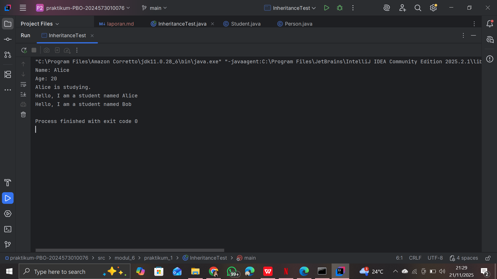
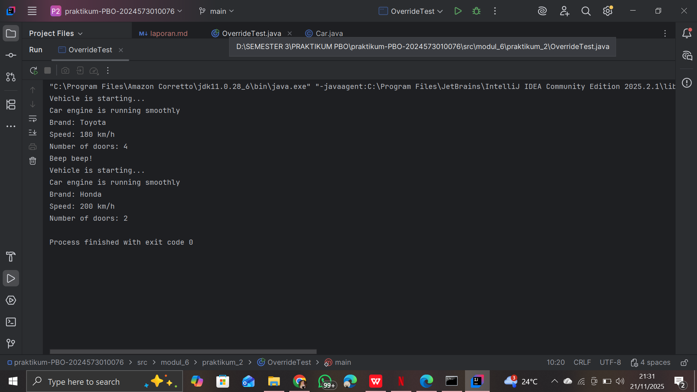
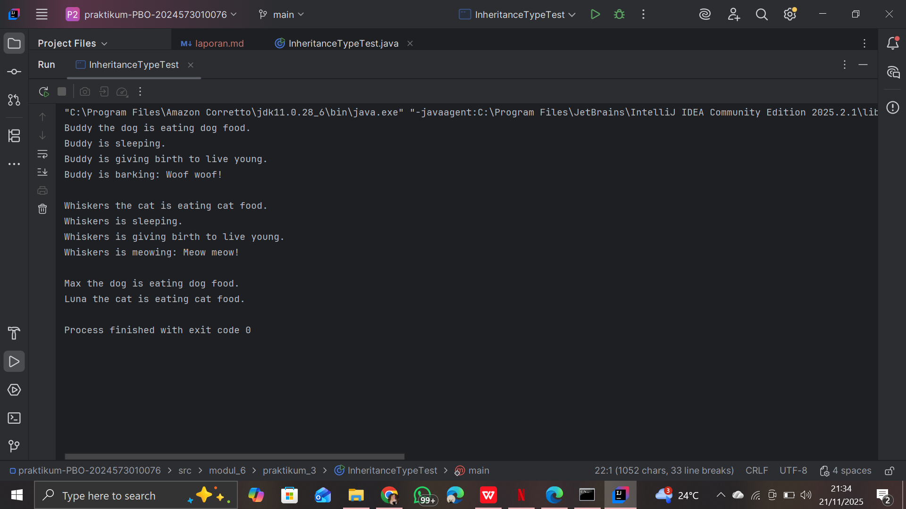
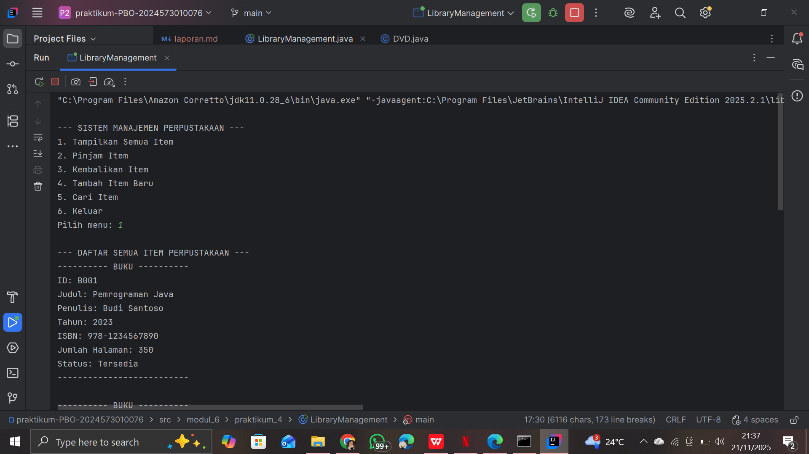

# Laporan Modul 6: Inheritance (Pewarisan)

**Mata Kuliah:** Praktikum Pemrograman Berorientasi Objek\
**Nama:** Nasywa Nurshabira     
**NIM:** 2024573010066     
**Kelas:** TI 2A

------------------------------------------------------------------------

## 1. Abstrak

Modul ini membahas konsep dasar *inheritance* dalam pemrograman
berorientasi objek, di mana sebuah kelas dapat mewarisi atribut dan
method dari kelas lain. Praktikum ini terdiri dari implementasi single
inheritance, method overriding, hierarchical & multilevel inheritance,
hingga penerapan inheritance pada kasus nyata berupa sistem manajemen
perpustakaan sederhana. Tujuan utama praktikum ini adalah memahami
hubungan antar kelas, mekanisme pewarisan, reusability kode, serta
kemampuan melakukan ekspansi fungsionalitas tanpa menulis ulang kode
induk.

------------------------------------------------------------------------

# 2. Praktikum

## Praktikum 1 -- Memahami Single Inheritance

### Dasar Teori

Single inheritance adalah pewarisan dari satu superclass menuju satu
subclass. Subclass memperoleh atribut dan method dari superclass melalui
keyword **`extends`**.

------------------------------------------------------------------------

### Langkah Praktikum

1.  Membuat package `modul_6.praktikum_1`.\
2.  Membuat kelas `Person` sebagai superclass.\

```
package modul_6.praktikum_1;

public class Person {
    protected String name;
    protected int age;

    public Person(String name, int age) {
        this.name = name;
        this.age = age;
    }

    public void displayInfo() {
        System.out.println("Name: " + name);
        System.out.println("Age: " + age);
    }

    public void greet() {
        System.out.println("Hello, I am a person.");
    }
}
```
3.  Membuat kelas `Student` sebagai subclass dari `Person`.\
```
package modul_6.praktikum_1;

public class Student extends Person {
    private String studentId;

    public Student(String name, int age, String studentId) {
        super(name, age); // Memanggil constructor dari class Person
        this.studentId = studentId;
    }

    public void study() {
        System.out.println(name + " is studying.");
    }

    @Override
    public void greet() {
        System.out.println("Hello, I am a student named " + name);
    }
}

```
4.  Membuat kelas `InheritanceTest` untuk menguji pewarisan.
```
package modul_6.praktikum_1;

public class InheritanceTest {
    public static void main(String[] args) {
        Student student = new Student("Alice", 20, "S12345");

        // Memanggil method dari superclass
        student.displayInfo();

        // Memanggil method dari subclass
        student.study();

        // Memanggil overridden method
        student.greet();

        // Polymorphism: Student sebagai Person
        Person person = new Student("Bob", 22, "S67890");
        person.greet(); // Memanggil method yang di-override
    }
}

```
------------------------------------------------------------------------

### Screenshoot Hasil



------------------------------------------------------------------------

### Analisa dan Pembahasan

Pada praktikum ini, ketika objek `Student` dibuat, ia dapat mengakses
atribut dan method dari `Person`. Subclass juga dapat memiliki method
tambahan yang tidak dimiliki superclass.

------------------------------------------------------------------------

## Praktikum 2 -- Method Overriding dan Kata Kunci super

### Dasar Teori

Method overriding adalah teknik menulis ulang method parent class pada
subclass. Keyword `super` digunakan untuk memanggil konstruktor atau
method superclass.

------------------------------------------------------------------------

### Langkah Praktikum

1.  Membuat package `modul_6.praktikum_2`.\
2.  Membuat superclass `Vehicle`.\
```
package modul_6.praktikum_2;

public class Vehicle {
    protected String brand;
    protected int speed;

    public Vehicle(String brand, int speed) {
        this.brand = brand;
        this.speed = speed;
    }

    public void start() {
        System.out.println("Vehicle is starting...");
    }

    public void displayInfo() {
        System.out.println("Brand: " + brand);
        System.out.println("Speed: " + speed + " km/h");
    }
}

```
3.  Membuat subclass `Car` yang *override* method parent.\
```
package modul_6.praktikum_2;

public class Car extends Vehicle {
    private int numberOfDoors;

    public Car(String brand, int speed, int numberOfDoors) {
        super(brand, speed); // Memanggil constructor dari Vehicle
        this.numberOfDoors = numberOfDoors;
    }

    @Override
    public void start() {
        super.start(); // Panggil method start() dari Vehicle dulu
        System.out.println("Car engine is running smoothly");
    }

    @Override
    public void displayInfo() {
        super.displayInfo(); // Tampilkan info dari Vehicle
        System.out.println("Number of doors: " + numberOfDoors);
    }

    public void honk() {
        System.out.println("Beep beep!");
    }
}

```
4.  Menggunakan `super()` pada constructor.\
5.  Membuat kelas `OverrideTest` untuk testing.
```
package modul_6.praktikum_2;

public class OverrideTest {
    public static void main(String[] args) {
        Car car = new Car("Toyota", 180, 4);

        // Memanggil overridden method
        car.start();
        car.displayInfo();
        car.honk();

        // Demonstrasi polymorphism
        Vehicle vehicle = new Car("Honda", 200, 2);
        vehicle.start();       // tetap jalankan versi milik Car
        vehicle.displayInfo(); // tetap jalankan versi milik Car
    }
}

```

------------------------------------------------------------------------

### Screenshoot Hasil



------------------------------------------------------------------------

### Analisa dan Pembahasan

Override method membuktikan *runtime polymorphism*. Penggunaan `super()`
memastikan konstruktor parent dipanggil terlebih dahulu.

------------------------------------------------------------------------

## Praktikum 3 -- Multilevel & Hierarchical Inheritance

### Dasar Teori

Multilevel inheritance: A → B → C\
Hierarchical inheritance: A → B dan A → C

------------------------------------------------------------------------

### Langkah Praktikum

1.  Membuat package `modul_6.praktikum_3`.\
2.  Membuat kelas `Animal`.\
```
package modul_6.praktikum_3;

public class Animal {
    protected String name;

    public Animal(String name) {
        this.name = name;
    }

    public void eat() {
        System.out.println(name + " is eating.");
    }

    public void sleep() {
        System.out.println(name + " is sleeping.");
    }
}

```
3.  Membuat kelas `Mammal`.\
```
package modul_6.praktikum_3;

public class Mammal extends Animal {
    protected String furColor;

    public Mammal(String name, String furColor) {
        super(name);
        this.furColor = furColor;
    }

    public void giveBirth() {
        System.out.println(name + " is giving birth to live young.");
    }
}

```
4.  Membuat kelas `Dog` & `Cat`.\
```
package modul_6.praktikum_3;

public class Dog extends Mammal {
    private String breed;

    public Dog(String name, String furColor, String breed) {
        super(name, furColor);
        this.breed = breed;
    }

    public void bark() {
        System.out.println(name + " is barking: Woof woof!");
    }

    @Override
    public void eat() {
        System.out.println(name + " the dog is eating dog food.");
    }
}

```
```
package modul_6.praktikum_3;

public class Cat extends Mammal {
    private boolean isIndoor;

    public Cat(String name, String furColor, boolean isIndoor) {
        super(name, furColor);
        this.isIndoor = isIndoor;
    }

    public void meow() {
        System.out.println(name + " is meowing: Meow meow!");
    }

    @Override
    public void eat() {
        System.out.println(name + " the cat is eating cat food.");
    }
}

```
5.  Membuat kelas `InheritanceTypeTest`.
```
package modul_6.praktikum_3;

public class InheritanceTypeTest {
    public static void main(String[] args) {
        // Multilevel inheritance test
        Dog dog = new Dog("Buddy", "Brown", "Golden Retriever");
        dog.eat();        // dari Animal, di-override di Dog
        dog.sleep();      // dari Animal
        dog.giveBirth();  // dari Mammal
        dog.bark();       // dari Dog

        System.out.println();

        // Hierarchical inheritance test
        Cat cat = new Cat("Whiskers", "White", true);
        cat.eat();        // di-override di Cat
        cat.sleep();      // dari Animal
        cat.giveBirth();  // dari Mammal
        cat.meow();       // dari Cat

        System.out.println();

        // Polymorphism dengan hierarchical inheritance
        Animal[] animals = {
                new Dog("Max", "Black", "Labrador"),
                new Cat("Luna", "Gray", false)
        };

        for (Animal animal : animals) {
            animal.eat(); // akan memanggil method sesuai objek sebenarnya
        }
    }
}

```

------------------------------------------------------------------------

### Screenshoot Hasil



------------------------------------------------------------------------

### Analisa dan Pembahasan

Objek `Dog` memanggil konstruktor `Animal → Mammal → Dog`. Pada
hierarchical inheritance, `Dog` dan `Cat` mewarisi dari parent yang sama
tetapi memiliki perilaku berbeda.

------------------------------------------------------------------------

## Praktikum 4 -- Sistem Manajemen Perpustakaan Sederhana

### Dasar Teori

Inheritance diterapkan pada kasus nyata menggunakan superclass
`LibraryItem` dan subclass: Book, Magazine, DVD.

------------------------------------------------------------------------

### Langkah Praktikum

1.  Membuat package `modul_6.praktikum_4`.\
2.  Membuat superclass `LibraryItem`.\
```
package modul_6.praktikum_4;

public abstract class LibraryItem {
    protected String itemId;
    protected String title;
    protected int year;
    protected boolean isAvailable;

    public LibraryItem(String itemId, String title, int year) {
        this.itemId = itemId;
        this.title = title;
        this.year = year;
        this.isAvailable = true;
    }

    // Getter methods
    public String getItemId() { return itemId; }
    public String getTitle() { return title; }
    public int getYear() { return year; }
    public boolean isAvailable() { return isAvailable; }

    // Setter method
    public void setAvailable(boolean available) { isAvailable = available; }

    // Abstract method (harus diimplementasikan oleh subclass)
    public abstract void displayInfo();

    // Concrete methods (bisa dipakai semua subclass)
    public void borrowItem() {
        if (isAvailable) {
            isAvailable = false;
            System.out.println(title + " berhasil dipinjam.");
        } else {
            System.out.println(title + " sedang tidak tersedia.");
        }
    }

    public void returnItem() {
        isAvailable = true;
        System.out.println(title + " berhasil dikembalikan.");
    }
}

```
3.  Membuat subclass Book, Magazine, dan DVD.\
```
package modul_6.praktikum_4;

public class Book extends LibraryItem {
    private String author;
    private String isbn;
    private int numberOfPages;

    public Book(String itemId, String title, int year, String author, String isbn, int numberOfPages) {
        super(itemId, title, year);
        this.author = author;
        this.isbn = isbn;
        this.numberOfPages = numberOfPages;
    }

    @Override
    public void displayInfo() {
        System.out.println("---------- BUKU ----------");
        System.out.println("ID: " + itemId);
        System.out.println("Judul: " + title);
        System.out.println("Penulis: " + author);
        System.out.println("Tahun: " + year);
        System.out.println("ISBN: " + isbn);
        System.out.println("Jumlah Halaman: " + numberOfPages);
        System.out.println("Status: " + (isAvailable ? "Tersedia" : "Dipinjam"));
        System.out.println("--------------------------");
    }

    // Method khusus Book
    public void readSample() {
        System.out.println("Membaca sample dari buku: " + title);
    }
}

```

```
package modul_6.praktikum_4;

public class Magazine extends LibraryItem {
    private String publisher;
    private int issueNumber;
    private String category;

    public Magazine(String itemId, String title, int year, String publisher, int issueNumber, String category) {
        super(itemId, title, year);
        this.publisher = publisher;
        this.issueNumber = issueNumber;
        this.category = category;
    }

    @Override
    public void displayInfo() {
        System.out.println("---------- MAJALAH ----------");
        System.out.println("ID: " + itemId);
        System.out.println("Judul: " + title);
        System.out.println("Penerbit: " + publisher);
        System.out.println("Tahun: " + year);
        System.out.println("Edisi: " + issueNumber);
        System.out.println("Kategori: " + category);
        System.out.println("Status: " + (isAvailable ? "Tersedia" : "Dipinjam"));
        System.out.println("-----------------------------");
    }

    // Method khusus Magazine
    public void browseArticles() {
        System.out.println("Menelusuri artikel dalam majalah: " + title);
    }
}

```
```
package modul_6.praktikum_4;

public class DVD extends LibraryItem {
    private String director;
    private int duration; // dalam menit
    private String genre;

    public DVD(String itemId, String title, int year, String director, int duration, String genre) {
        super(itemId, title, year);
        this.director = director;
        this.duration = duration;
        this.genre = genre;
    }

    @Override
    public void displayInfo() {
        System.out.println("---- DVD ----");
        System.out.println("ID: " + itemId);
        System.out.println("Judul: " + title);
        System.out.println("Sutradara: " + director);
        System.out.println("Tahun: " + year);
        System.out.println("Durasi: " + duration + " menit");
        System.out.println("Genre: " + genre);
        System.out.println("Status: " + (isAvailable ? "Tersedia" : "Dipinjam"));
        System.out.println("---------------------------");
    }

    // Method khusus DVD
    public void playTrailer() {
        System.out.println("Memutar trailer DVD: " + title);
    }
}

```
4.  Membuat `LibraryManagementSystem`.
```
package modul_6.praktikum_4;

import java.util.ArrayList;
import java.util.Scanner;

public class LibraryManagement {
    private static ArrayList<LibraryItem> libraryItems = new ArrayList<>();
    private static Scanner scanner = new Scanner(System.in);
    public static void main(String[] args) {
        initializeSampleData();

        while (true) {
            displayMenu();
            int choice = scanner.nextInt();
            scanner.nextLine(); // consume newline

            switch (choice) {
                case 1:
                    displayAllItems();
                    break;
                case 2:
                    borrowItem();
                    break;
                case 3:
                    returnItem();
                    break;
                case 4:
                    addNewItem();
                    break;
                case 5:
                    searchItem();
                    break;
                case 6:
                    System.out.println("Terima kasih telah menggunakan sistem perpustakaan!");
                    return;
                default:
                    System.out.println("Pilihan tidak valid");
            }
        }
    }

    private static void displayMenu() {
        System.out.println("\n--- SISTEM MANAJEMEN PERPUSTAKAAN ---");
        System.out.println("1. Tampilkan Semua Item");
        System.out.println("2. Pinjam Item");
        System.out.println("3. Kembalikan Item");
        System.out.println("4. Tambah Item Baru");
        System.out.println("5. Cari Item");
        System.out.println("6. Keluar");
        System.out.print("Pilih menu: ");
    }

    private static void initializeSampleData() {
        // Tambahkan sample data
        libraryItems.add(new Book("B001", "Pemrograman Java", 2023, "Budi Santoso", "978-1234567890", 350));
        libraryItems.add(new Book("B002", "Struktur Data", 2022, "Sari Dewi", "978-0987654321", 280));
        libraryItems.add(new Magazine("M001", "National Geographic", 2024, "NG Media", 245, "Sains"));
        libraryItems.add(new DVD("D001", "The Java Documentary", 2023, "John Programmer", 120, "Edukasi"));
    }

    private static void displayAllItems() {
        System.out.println("\n--- DAFTAR SEMUA ITEM PERPUSTAKAAN ---");
        for (LibraryItem item : libraryItems) {
            item.displayInfo();
            System.out.println();
        }
    }

    private static void borrowItem() {
        System.out.print("Masukkan ID item yang ingin dipinjam: ");
        String itemId = scanner.nextLine();

        for (LibraryItem item : libraryItems) {
            if (item.getItemId().equalsIgnoreCase(itemId)) {
                item.borrowItem();
                return;
            }
        }

        System.out.println("Item dengan ID " + itemId + " tidak ditemukan!");
    }

    private static void returnItem() {
        System.out.print("Masukkan ID item yang ingin dikembalikan: ");
        String itemId = scanner.nextLine();

        for (LibraryItem item : libraryItems) {
            if (item.getItemId().equalsIgnoreCase(itemId)) {
                item.returnItem();
                return;
            }
        }

        System.out.println("Item dengan ID " + itemId + " tidak ditemukan!");
    }

    private static void addNewItem() {
        System.out.println("\n--- TAMBAH ITEM BARU ---");
        System.out.println("1. Buku");
        System.out.println("2. Majalah");
        System.out.println("3. DVD");
        System.out.print("Pilih jenis item: ");
        int type = scanner.nextInt();
        scanner.nextLine();

        System.out.print("ID Item: ");
        String itemId = scanner.nextLine();
        System.out.print("Judul: ");
        String title = scanner.nextLine();
        System.out.print("Tahun: ");
        int year = scanner.nextInt();
        scanner.nextLine();

        switch (type) {
            case 1:
                System.out.print("Penulis: ");
                String author = scanner.nextLine();
                System.out.print("ISBN: ");
                String isbn = scanner.nextLine();
                System.out.print("Jumlah Halaman: ");
                int pages = scanner.nextInt();
                scanner.nextLine();
                libraryItems.add(new Book(itemId, title, year, author, isbn, pages));
                break;
            case 2:
                System.out.print("Penerbit: ");
                String publisher = scanner.nextLine();
                System.out.print("Edisi: ");
                int issue = scanner.nextInt();
                scanner.nextLine();
                System.out.print("Kategori: ");
                String category = scanner.nextLine();
                libraryItems.add(new Magazine(itemId, title, year, publisher, issue, category));
                break;
            case 3:
                System.out.print("Sutradara: ");
                String director = scanner.nextLine();
                System.out.print("Durasi (menit): ");
                int duration = scanner.nextInt();
                scanner.nextLine();
                System.out.print("Genre: ");
                String genre = scanner.nextLine();
                libraryItems.add(new DVD(itemId, title, year, director, duration, genre));
                break;
            default:
                System.out.println("Jenis item tidak valid!");
                return;
        }

        System.out.println("Item berhasil ditambahkan!");
    }

    private static void searchItem() {
        System.out.print("Masukkan kata kunci pencarian (judul/penulis): ");
        String keyword = scanner.nextLine().toLowerCase();
        boolean found = false;

        System.out.println("\n--- HASIL PENCARIAN ---");

        for (LibraryItem item : libraryItems) {
            if (item.getTitle().toLowerCase().contains(keyword)) {
                item.displayInfo();
                System.out.println();
                found = true;
            }
        }

        if (!found) {
            System.out.println("Tidak ada item yang sesuai dengan pencarian.");
        }
    }

}

```

------------------------------------------------------------------------

### Screenshoot Hasil



------------------------------------------------------------------------

### Analisa dan Pembahasan

Polymorphism memungkinkan semua jenis item diproses sebagai
`LibraryItem`. Kode menjadi lebih bersih dan mudah dikembangkan.

------------------------------------------------------------------------

# 3. Kesimpulan

Inheritance adalah konsep penting dalam OOP yang meningkatkan efisiensi
kode, mengurangi duplikasi, dan mempermudah pengembangan program.
Keempat praktikum telah menunjukkan bagaimana pewarisan bekerja dalam
berbagai bentuk.

------------------------------------------------------------------------

# 5. Referensi

1.  Modul Praktikum 6 -- Inheritance ---
    https://hackmd.io/@mohdrzu/r1Cxc-p0eg\
2.  Oracle Java Documentation ---
    https://docs.oracle.com/javase/tutorial/java/IandI\
3.  GeeksForGeeks -- Inheritance in Java ---
    https://www.geeksforgeeks.org/inheritance-in-java
