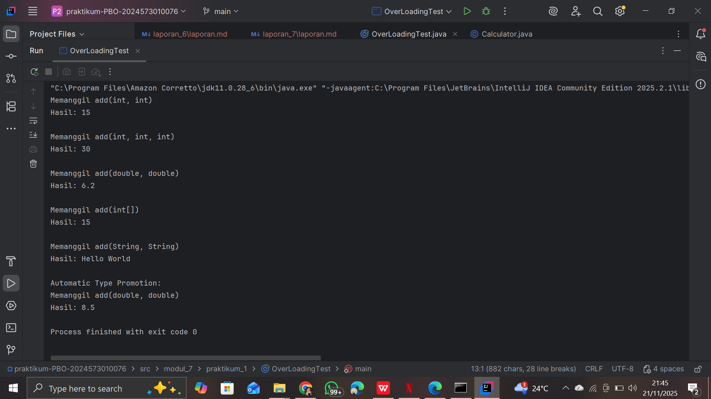
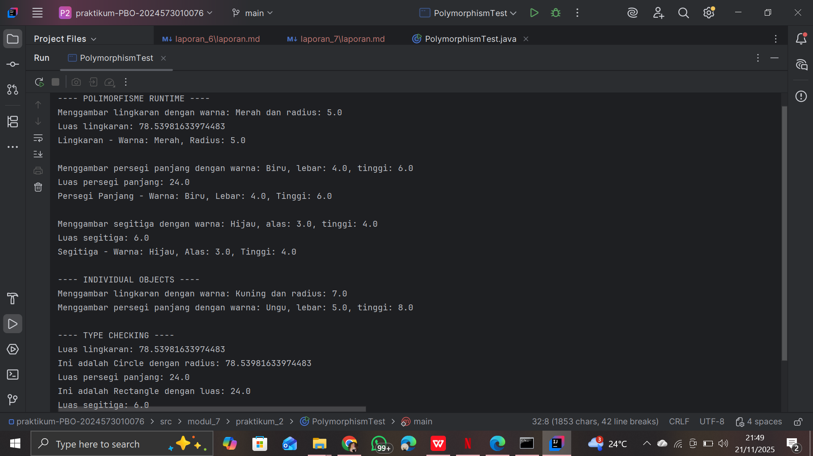

# Laporan Modul 7: Polymorphism
**Mata Kuliah:** Praktikum Pemrograman Berorientasi Objek  
**Nama:** Nasywa Nurshabira  
**NIM:** 2024573010076  
**Kelas:** TI 2A

---

## 1. Abstrak
Laporan ini membahas konsep polymorphism dalam pemrograman berorientasi objek menggunakan bahasa Java. Polymorphism memungkinkan satu method atau interface digunakan oleh berbagai tipe objek, sehingga meningkatkan fleksibilitas dan modularitas kode. Praktikum ini mencakup overloading, overriding, polymorphism melalui interface, array of objects, dan parameter method. Tujuan laporan ini adalah memahami penerapan polymorphism serta manfaatnya dalam desain program.

---

## 2. Praktikum

### Praktikum 1 – Method Overloading
#### Dasar Teori
Method overloading adalah bentuk compile‑time polymorphism, yaitu beberapa method memiliki nama yang sama tetapi parameter berbeda.

#### Langkah Praktikum
1. Membuat class Calculator.
```
package modul_7.praktikum_1;

public class Calculator {
    // Method untuk menjumlahkan dua integer
    public int add(int a, int b) {
        System.out.println("Memanggil add(int, int)");
        return a + b;
    }

    // Overload method untuk menjumlahkan tiga integer
    public int add(int a, int b, int c) {
        System.out.println("Memanggil add(int, int, int)");
        return a + b + c;
    }

    // Overload method untuk menjumlahkan dua double
    public double add(double a, double b) {
        System.out.println("Memanggil add(double, double)");
        return a + b;
    }

    // Overload method untuk menjumlahkan array integer
    public int add(int[] numbers) {
        System.out.println("Memanggil add(int[])");
        int sum = 0;
        for (int num : numbers) {
            sum += num;
        }
        return sum;
    }

    // Overload method untuk concatenate strings
    public String add(String a, String b) {
        System.out.println("Memanggil add(String, String)");
        return a + b;
    }
}

```
2. Membuat beberapa method add dengan parameter berbeda.
3. Membuat class tester untuk menjalankan method.
```
package modul_7.praktikum_1;

public class OverLoadingTest {
    public static void main(String[] args) {
        Calculator calc = new Calculator();

        // Test berbagai versi method add
        System.out.println("Hasil: " + calc.add(5, 10));
        System.out.println();

        System.out.println("Hasil: " + calc.add(5, 10, 15));
        System.out.println();

        System.out.println("Hasil: " + calc.add(3.5, 2.7));
        System.out.println();

        int[] numbers = {1, 2, 3, 4, 5};
        System.out.println("Hasil: " + calc.add(numbers));
        System.out.println();

        System.out.println("Hasil: " + calc.add("Hello", " World"));
        System.out.println();

        // Demonstrasi automatic type promotion
        System.out.println("Automatic Type Promotion:");
        System.out.println("Hasil: " + calc.add(5, 3.5)); // int + double
    }
}

```

#### Screenshoot Hasil


#### Analisa dan Pembahasan
Compiler memilih method berdasarkan parameter yang digunakan pada saat kompilasi.

---

### Praktikum 2 – Method Overriding
#### Dasar Teori
Method overriding adalah bentuk runtime polymorphism. Subclass memberikan implementasi ulang terhadap method superclass.

#### Langkah Praktikum
1. Membuat superclass Shape.
```
package modul_7.praktikum_2;

public class Shape {
    protected String color;

    public Shape(String color) {
        this.color = color;
    }

    public void draw() {
        System.out.println("Menggambar shape dengan warna: " + color);
    }

    public double calculateArea() {
        System.out.println("Menghitung luas shape umum");
        return 0.0;
    }

    public void displayInfo() {
        System.out.println("Shape - Warna: " + color);
    }
}

```
2. Membuat subclass Circle, Rectangle, Triangle.
```
package modul_7.praktikum_2;

public class Circle extends Shape{
    private double radius;

    public Circle(String color, double radius) {
        super(color);
        this.radius = radius;
    }

    @Override
    public void draw() {
        System.out.println("Menggambar lingkaran dengan warna: " + color + " dan radius: " + radius);
    }

    @Override
    public double calculateArea() {
        double area = Math.PI * radius * radius;
        System.out.println("Luas lingkaran: " + area);
        return area;
    }

    @Override
    public void displayInfo() {
        System.out.println("Lingkaran - Warna: " + color + ", Radius: " + radius);
    }

}

```

```
package modul_7.praktikum_2;

public class Rectangle extends Shape{
    private double width;
    private double height;

    public Rectangle(String color, double width, double height) {
        super(color);
        this.width = width;
        this.height = height;
    }

    @Override
    public void draw() {
        System.out.println("Menggambar persegi panjang dengan warna: " + color + ", lebar: " + width + ", tinggi: " + height);
    }

    @Override
    public double calculateArea() {
        double area = width * height;
        System.out.println("Luas persegi panjang: " + area);
        return area;
    }

    @Override
    public void displayInfo() {
        System.out.println("Persegi Panjang - Warna: " + color + ", Lebar: " + width + ", Tinggi: " + height);
    }
}

```

```
package modul_7.praktikum_2;

public class Triangle extends Shape{
    private double base;
    private double height;

    public Triangle(String color, double base, double height) {
        super(color);
        this.base = base;
        this.height = height;
    }
    @Override
    public void draw() {
        System.out.println("Menggambar segitiga dengan warna: " + color + ", alas: " + base + ", tinggi: " + height);
    }

    @Override
    public double calculateArea() {
        double area = 0.5 * base * height;
        System.out.println("Luas segitiga: " + area);
        return area;
    }

    @Override
    public void displayInfo() {
        System.out.println("Segitiga - Warna: " + color + ", Alas: " + base + ", Tinggi: " + height);
    }
}

```
3. Override method draw() dan area().
4. Menguji polymorphism dengan referensi Shape.
```
package modul_7.praktikum_2;

public class PolymorphismTest {
    public static void main(String[] args) {
        // Demonstrasi runtime polymorphism
        Shape[] shapes = new Shape[3];
        shapes[0] = new Circle("Merah", 5.0);
        shapes[1] = new Rectangle("Biru", 4.0, 6.0);
        shapes[2] = new Triangle("Hijau", 3.0, 4.0);

        System.out.println("---- POLIMORFISME RUNTIME ----");
        for (Shape shape : shapes) {
            shape.draw();              // Akan memanggil method sesuai objek sebenarnya
            shape.calculateArea();     // Akan memanggil method sesuai objek sebenarnya
            shape.displayInfo();       // Akan memanggil method sesuai objek sebenarnya
            System.out.println();
        }

        // Demonstrasi dengan individual objects
        System.out.println("---- INDIVIDUAL OBJECTS ----");
        Shape shape1 = new Circle("Kuning", 7.0);
        Shape shape2 = new Rectangle("Ungu", 5.0, 8.0);

        shape1.draw();    // Memanggil Circle's draw()
        shape2.draw();    // Memanggil Rectangle's draw()

        // Type casting dan instanceof
        System.out.println("\n---- TYPE CHECKING ----");
        for (Shape shape : shapes) {
            if (shape instanceof Circle) {
                Circle circle = (Circle) shape;
                System.out.println("Ini adalah Circle dengan radius: " + circle.calculateArea());
            } else if (shape instanceof Rectangle) {
                Rectangle rectangle = (Rectangle) shape;
                System.out.println("Ini adalah Rectangle dengan luas: " + rectangle.calculateArea());
            } else if (shape instanceof Triangle) {
                Triangle triangle = (Triangle) shape;
                System.out.println("Ini adalah Triangle dengan luas: " + triangle.calculateArea());
            }
        }
    }
}

```

#### Screenshoot Hasil


#### Analisa dan Pembahasan
Pemanggilan method ditentukan saat runtime berdasarkan objek sebenarnya.

---

## 3. Kesimpulan
Polymorphism memungkinkan penggunaan method yang sama untuk berbagai objek sehingga kode menjadi lebih fleksibel, mudah diperluas, dan mudah dipelihara.

---

## 5. Referensi
1. Polymorphism in Java — GeeksforGeeks
2. Overloading vs Overriding in Java — GeeksforGeeks
3. Java67 — Polymorphism, Overloading, and Overriding
4. MakeUseOf — Polymorphism in Java

---
