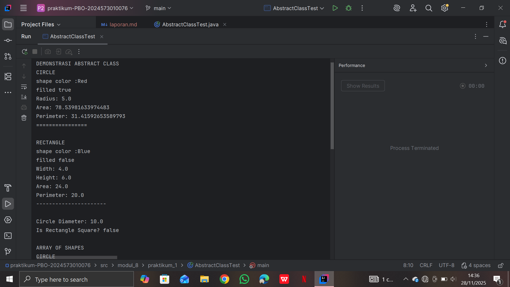
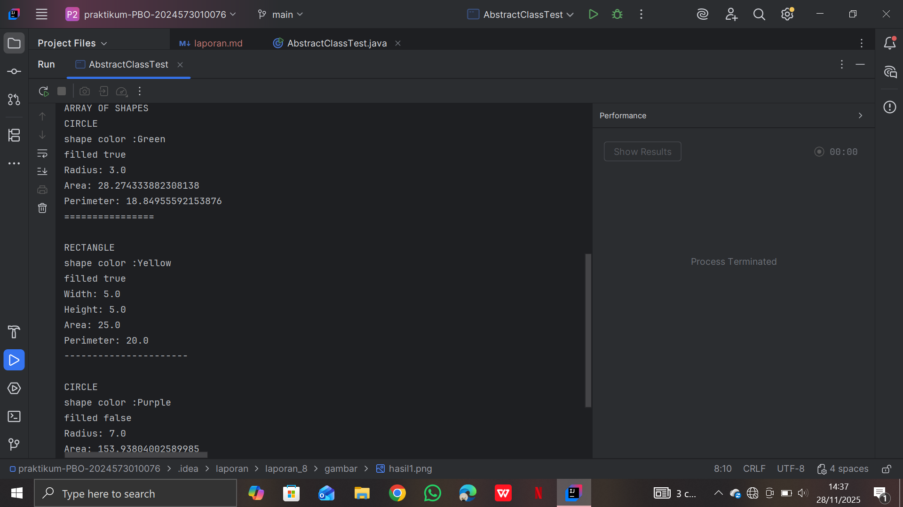
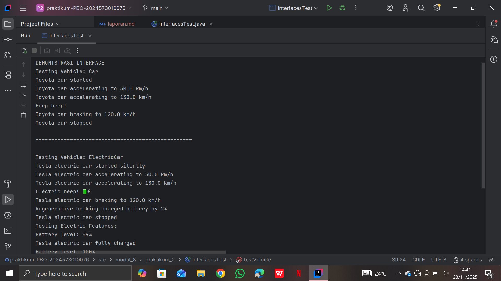
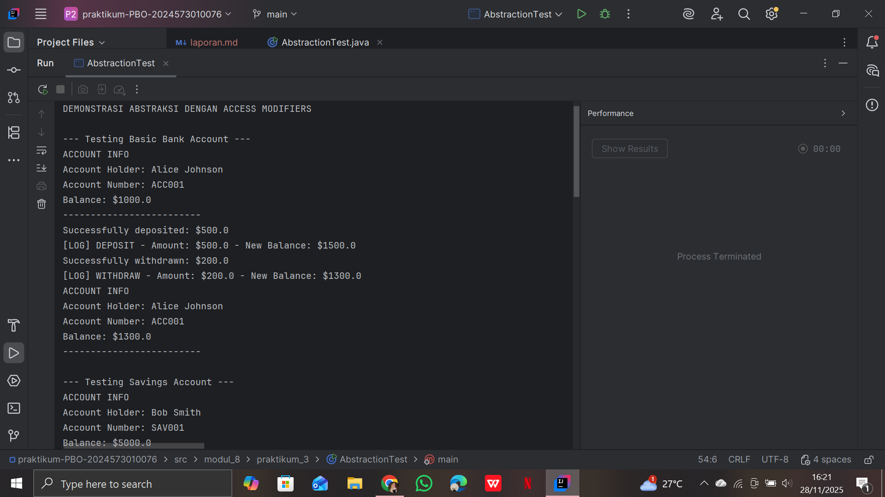
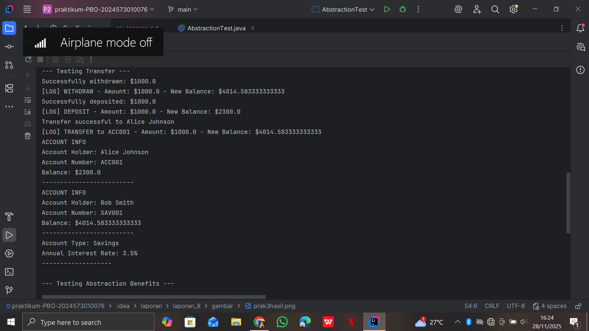

# Laporan Modul 8: Abstraction
**Mata Kuliah:** Praktikum Pemrograman Berorientasi Objek   
**Nama:** [Nasywa Nurshabira]  
**NIM:** [2024573010076]  
**Kelas:** [TI 2A]

---

## 1. Abstrak
Modul ini membahas konsep abstraction dalam Pemrograman Berorientasi Objek (OOP). Abstraksi adalah proses menyembunyikan detail implementasi dan hanya menampilkan fungsionalitas penting kepada pengguna. Dalam praktikum ini, mahasiswa mempelajari penerapan abstraksi menggunakan abstract class, abstract method, dan interface, serta memahami peran access modifier dalam mendukung abstraksi. Tujuan praktikum ini adalah agar mahasiswa dapat menerapkan abstraksi untuk menyederhanakan struktur program, meningkatkan keamanan data, serta meminimalkan kompleksitas kode.

---
## 2. Praktikum
### Praktikum 1 - Abstract class dan Abstract method
#### Dasar Teori
Abstract class → kelas yang tidak bisa diinstansiasi dan digunakan sebagai kerangka dasar class turunan.

Abstract method → method tanpa body yang harus dioverride oleh subclass.

Abstract class boleh berisi:
- Constructor
- Field
- Method biasa
- Method abstract

Tujuan abstraksi:
- Menyembunyikan detail implementasi
- Memaksa subclass menyediakan implementasi spesifik
- Mengurangi duplikasi kode
#### Langkah Praktikum
- Buat package modul_8.praktikum_1
- Buat abstract class Shape
```
package modul_8.praktikum_1;

public abstract class Shape {
    protected String color;
    protected Boolean filled;

    //constructor
    public Shape(String color, Boolean filled) {
        this.color = color;
        this.filled = filled;
    }
    //abstract methods - harus diimplementasikan subclass
    public abstract double calcuLateArea();
    public abstract double calcuLatePerimeter();

    //constructor methods - sudah memilki implementasi
    public String getColor() {
        return color;
    }

    public void setColor() {
        this.color = color;
    }

    public Boolean isFilled() {
        return filled;
    }

    public void setFilled() {
        this.filled = filled;
    }

    //concrete method yang bisa di override
    public void displayInfo() {
        System.out.println("shape color :" + color);
        System.out.println("filled " + filled);
    }
}

```
- Buat class Circle extends Shape
```
package modul_8.praktikum_1;

public class Circle extends Shape{
    private double radius;

    public Circle(String color, boolean filled, double radius) {
        super(color, filled);
        this.radius = radius;
    }

    // Implementasi abstract methods
    @Override
    public double calcuLateArea() {
        return Math.PI * radius * radius;
    }

    @Override
    public double calcuLatePerimeter() {
        return 2 * Math.PI * radius;
    }

    // Override concrete method
    @Override
    public void displayInfo() {
        System.out.println("CIRCLE");
        super.displayInfo();
        System.out.println("Radius: " + radius);
        System.out.println("Area: " + calcuLateArea());
        System.out.println("Perimeter: " + calcuLatePerimeter());
        System.out.println("================");
    }

    // Method khusus Circle
    public double getDiameter() {
        return 2 * radius;
    }
}

```
- Buat class Rectangle extends Shape
```
package modul_8.praktikum_1;

public class Rectangle extends Shape{
    private double width;
    private double height;

    public Rectangle(String color, boolean filled, double width, double height) {
        super(color, filled);
        this.width = width;
        this.height = height;
    }

    // Implementasi abstract methods
    @Override
    public double calcuLateArea() {
        return width * height;
    }

    @Override
    public double calcuLatePerimeter() {
        return 2 * (width + height);
    }

    // Override concrete method
    @Override
    public void displayInfo() {
        System.out.println("RECTANGLE");
        super.displayInfo();
        System.out.println("Width: " + width);
        System.out.println("Height: " + height);
        System.out.println("Area: " + calcuLateArea());
        System.out.println("Perimeter: " + calcuLatePerimeter());
        System.out.println("----------------------");
    }

    // Method khusus Rectangle
    public boolean isSquare() {
        return width == height;
    }
}

```
- Buat class AbstractClassTest
```
package modul_8.praktikum_1;

public class AbstractClassTest {
    public static void main(String[] args) {

        // Mencoba membuat instance dari abstract class (akan error)
        // Shape shape = new Shape("Red", true);
        // ERROR: Shape is abstract; cannot be instantiated

        // Membuat objects dari concrete subclasses
        Circle circle = new Circle("Red", true, 5.0);
        Rectangle rectangle = new Rectangle("Blue", false, 4.0, 6.0);

        System.out.println("DEMONSTRASI ABSTRACT CLASS");

        // Menggunakan abstract class reference
        Shape shape1 = circle;
        Shape shape2 = rectangle;

        // Polymorphic calls
        shape1.displayInfo();
        System.out.println();

        shape2.displayInfo();
        System.out.println();

        // Mengakses method khusus subclass melalui casting
        System.out.println("Circle Diameter: " + circle.getDiameter());
        System.out.println("Is Rectangle Square? " + rectangle.isSquare());

        // Array of Shapes - demonstrating polymorphism
        System.out.println("\nARRAY OF SHAPES");
        Shape[] shapes = new Shape[3];
        shapes[0] = new Circle("Green", true, 3.0);
        shapes[1] = new Rectangle("Yellow", true, 5.0, 5.0);
        shapes[2] = new Circle("Purple", false, 7.0);

        double totalArea = 0;
        for (Shape shape : shapes) {
            shape.displayInfo();
            totalArea += shape.calcuLateArea();
            System.out.println();
        }

        System.out.println("Total Area of All Shapes: " + totalArea);
    }

}

```
- Coba memanggil new Shape() untuk melihat error
#### Screenshoot Hasil



#### Analisa dan Pembahasan
Pada praktikum ini, abstraksi diterapkan melalui abstract class Shape yang mendefinisikan struktur umum sebuah bentuk (shape) tetapi tidak memberikan implementasi detail. Subclass Circle dan Rectangle mengoverride method abstrak tersebut dan menyediakan implementasi sesuai bentuk masing-masing. Ketika mencoba membuat instance langsung dari Shape, program menghasilkan error karena abstract class tidak dapat diinstansiasi. Ini menegaskan bahwa abstract class digunakan sebagai kerangka, bukan objek konkret.

### Praktikum 2 - Interface
#### Dasar Teori
Interface adalah kontrak yang mendefinisikan method yang wajib diimplementasikan oleh class.       

Karakteristik interface:
- Semua method default-nya abstrak & public
- Mendukung multiple inheritance
- Mendukung default method (Java 8+)
- Variable selalu public static final

Interface digunakan untuk:
- Mendukung polimorfisme
- Menyatukan standar perilaku pada banyak class
- Menciptakan dependency berbasis kontrak
#### Langkah Praktikum
- Buat package modul_8.praktikum_2
- Buat interface Vehicle
```
package modul_8.praktikum_2;

public interface Vehicle {
    // Constant fields (public static final by default)
    int MAX_SPEED = 200;

    // Abstract methods (public abstract by default)
    void start();
    void stop();
    void accelerate(double speed);
    void brake();

    // Default method (Java 8+)
    default void honk() {
        System.out.println("Beep beep!");
    }

    // Static method (Java 8+)
    static void displayMaxSpeed() {
        System.out.println("Maximum speed for all vehicles: " + MAX_SPEED + " km/h");
    }
}

```
- Buat interface Electric
```
package modul_8.praktikum_2;

public interface Electric {
    void charge();
    int getBatteryLevel();
    void setBatteryLevel(int level);

    default void displayBatteryInfo() {
        System.out.println("Battery level: " + getBatteryLevel() + "%");
    }
}

```
- Buat class Car implements Vehicle
```
package modul_8.praktikum_2;

public class Car  implements Vehicle{
    private String brand;
    private double currentSpeed;
    private boolean isRunning;

    public Car(String brand) {
        this.brand = brand;
        this.currentSpeed = 0;
        this.isRunning = false;
    }

    @Override
    public void start() {
        if (!isRunning) {
            isRunning = true;
            System.out.println(brand + " car started");
        } else {
            System.out.println(brand + " car is already running");
        }
    }

    @Override
    public void stop() {
        if (isRunning) {
            isRunning = false;
            currentSpeed = 0;
            System.out.println(brand + " car stopped");
        } else {
            System.out.println(brand + " car is already stopped");
        }
    }

    @Override
    public void accelerate(double speed) {
        if (isRunning) {
            currentSpeed += speed;
            if (currentSpeed > MAX_SPEED) {
                currentSpeed = MAX_SPEED;
            }
            System.out.println(brand + " car accelerating to " + currentSpeed + " km/h");
        } else {
            System.out.println("Please start the car first");
        }
    }

    @Override
    public void brake() {
        if (currentSpeed > 0) {
            currentSpeed -= 10;
            if (currentSpeed < 0) currentSpeed = 0;
            System.out.println(brand + " car braking to " + currentSpeed + " km/h");
        } else {
            System.out.println(brand + " car is already stopped");
        }
    }

    // Getter methods
    public String getBrand() { return brand; }
    public double getCurrentSpeed() { return currentSpeed; }
    public boolean isRunning() { return isRunning; }
}

```
- Buat class ElectricCar implements Vehicle, Electric
```
package modul_8.praktikum_2;

public class ElectricCar implements Vehicle, Electric{
    String brand;
    private double currentSpeed;
    private boolean isRunning;
    private int batteryLevel;

    public ElectricCar(String brand) {
        this.brand = brand;
        this.currentSpeed = 0;
        this.isRunning = false;
        this.batteryLevel = 100; // Fully charged
    }

    // Implement Vehicle interface methods
    @Override
    public void start() {
        if (!isRunning && batteryLevel > 0) {
            isRunning = true;
            System.out.println(brand + " electric car started silently");
        } else if (batteryLevel <= 0) {
            System.out.println("Cannot start. Battery is empty. Please charge first.");
        } else {
            System.out.println(brand + " electric car is already running");
        }
    }

    @Override
    public void stop() {
        if (isRunning) {
            isRunning = false;
            currentSpeed = 0;
            System.out.println(brand + " electric car stopped");
        } else {
            System.out.println(brand + " electric car is already stopped");
        }
    }

    @Override
    public void accelerate(double speed) {
        if (isRunning && batteryLevel > 0) {
            currentSpeed += speed;
            batteryLevel -= (int)(speed / 10); // Battery consumption
            if (batteryLevel < 0) batteryLevel = 0;
            if (currentSpeed > MAX_SPEED) currentSpeed = MAX_SPEED;
            System.out.println(brand + " electric car accelerating to " + currentSpeed + " km/h");
        } else if (batteryLevel <= 0) {
            System.out.println("Cannot accelerate. Battery is empty.");
        } else {
            System.out.println("Please start the car first");
        }
    }

    @Override
    public void brake() {
        if (currentSpeed > 0) {
            currentSpeed -= 10;
            if (currentSpeed < 0) currentSpeed = 0;
            System.out.println(brand + " electric car braking to " + currentSpeed + " km/h");

            // Regenerative braking - charge battery slightly
            if (batteryLevel < 100) {
                batteryLevel += 2;
                System.out.println("Regenerative braking charged battery by 2%");
            }
        } else {
            System.out.println(brand + " electric car is already stopped");
        }
    }

    // Override default method
    @Override
    public void honk() {
        System.out.println("Electric beep! 🔋⚡");
    }

    // Implement Electric interface methods
    @Override
    public void charge() {
        batteryLevel = 100;
        System.out.println(brand + " electric car fully charged");
    }

    @Override
    public int getBatteryLevel() {
        return batteryLevel;
    }

    @Override
    public void setBatteryLevel(int level) {
        if (level >= 0 && level <= 100) {
            batteryLevel = level;
        } else {
            System.out.println("Battery level must be between 0 and 100");
        }
    }

    // Getter methods
    public String getBrand() { return brand; }
    public double getCurrentSpeed() { return currentSpeed; }
    public boolean isRunning() { return isRunning; }
}

```
- Buat class InterfaceTest
```
package modul_8.praktikum_2;

public class InterfacesTest {
    public static void main(String[] args) {
        System.out.println("DEMONTSTRASI INTERFACE");

        // Test regular car
        Car car = new Car("Toyota");
        testVehicle(car);

        System.out.println("\n" + "=".repeat(50) + "\n");

        // Test electric car
        ElectricCar electricCar = new ElectricCar("Tesla");
        testVehicle(electricCar);
        testElectric(electricCar);

        System.out.println("\n" + "=".repeat(50) + "\n");

        // Demonstrasi multiple interface implementation
        System.out.println("MULTIPLE INTERFACE DEMO");
        electricCar.honk(); // Overridden default method
        electricCar.displayBatteryInfo(); // Default method from Electric interface

        // Static method call
        Vehicle.displayMaxSpeed();

        // Interface constants
        System.out.println("MAX_SPEED constant: " + Vehicle.MAX_SPEED + " km/h");
    }

    public static void testVehicle(Vehicle vehicle) {
        System.out.println("Testing Vehicle: " + vehicle.getClass().getSimpleName());
        vehicle.start();
        vehicle.accelerate(50);
        vehicle.accelerate(80);
        vehicle.honk(); // Default method
        vehicle.brake();
        vehicle.stop();
    }

    public static void testElectric(Electric electric) {
        System.out.println("Testing Electric Features:");
        electric.displayBatteryInfo();
        electric.charge();
        electric.displayBatteryInfo();
    }
}

```
- Jalankan program dan amati efek multiple interface
#### Screenshoot Hasil

#### Analisa dan Pembahasan
untuk mendefinisikan perilaku yang harus dimiliki suatu class. Class ElectricCar dapat mengimplementasikan beberapa interface sekaligus, yang menunjukkan kemampuan Java untuk melakukan multiple inheritance melalui interface. Default method pada interface juga memberikan fleksibilitas dalam menyediakan implementasi umum, tanpa memaksa semua class untuk melakukan override. Perbedaan antara abstract class dan interface terlihat jelas: interface tidak memiliki state, sedangkan abstract class dapat memiliki field dan constructor.

---
### Praktikum 3 - Abstraksi dengan Access Modifier
#### Dasar Teori
Access modifiers berfungsi untuk mengatur akses terhadap data dan method dalam class, mendukung abstraksi dengan menyembunyikan detail internal.

Jenis:
- private → hanya dapat diakses di class yang sama
- protected → dapat diakses oleh subclass
- public → dapat diakses dari mana pun
- Abstraksi + access modifiers = keamanan + encapsulation
#### Langkah Praktikum
- Buat package modul_8.praktikum_3
- Buat class BankAccount menggunakan:
  - private balance
  - public deposit() dan withdraw()
  - protected logTransaction()
- Buat class SavingsAccount extends BankAccount
- Buat class AbstractionTest
- Jalankan program dan perhatikan efek akses modifier
#### Screenshoot Hasil



#### Analisa dan pembahasan
Pada praktikum ini, abstraksi diwujudkan melalui penyembunyian field balance menggunakan modifier private. User tidak dapat mengubah balance secara langsung; hanya dapat melalui method public seperti deposit() dan withdraw(). Hal ini meningkatkan keamanan data. Method protected logTransaction() dapat dipakai oleh subclass SavingsAccount, menunjukkan bagaimana access modifier mendukung inheritance sekaligus abstraksi. Secara keseluruhan, praktikum ini menegaskan pentingnya pemisahan antara interface dan implementasi agar kode lebih aman, modular, dan mudah dikelola.

---

## 3. Kesimpulan
Melalui modul 8, mahasiswa memahami bahwa abstraksi adalah mekanisme penting untuk menyembunyikan detail internal suatu objek dan hanya menampilkan bagian pentingnya. Abstraksi dapat diterapkan menggunakan abstract class, interface, dan access modifiers. Dengan menerapkan abstraksi, kode menjadi lebih aman, lebih mudah dikelola, dan lebih modular serta mendukung pengembangan sistem besar dengan banyak komponen.

---
## 4. Referensi
1. Oracle Java Documentation — https://docs.oracle.com/javase
2. Geeks For Geeks: Abstraction in Java — https://www.geeksforgeeks.org/abstraction-in-java/
3. Tutorialspoint: Java OOP Concepts — https://www.tutorialspoint.com/java

---
